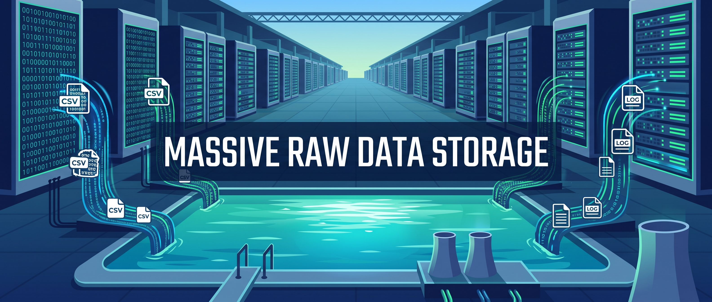
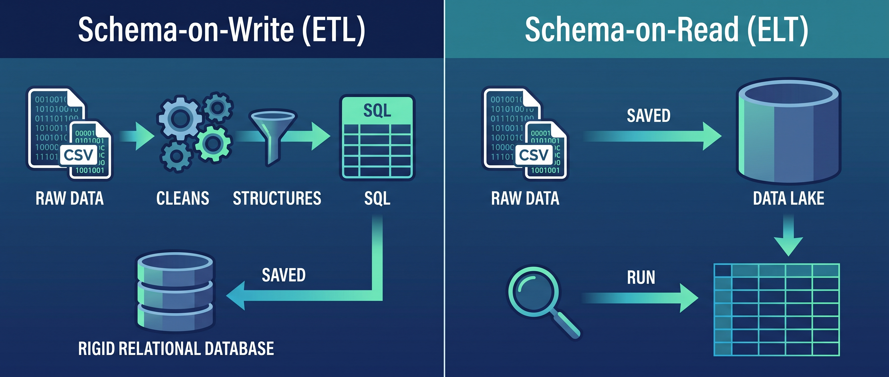
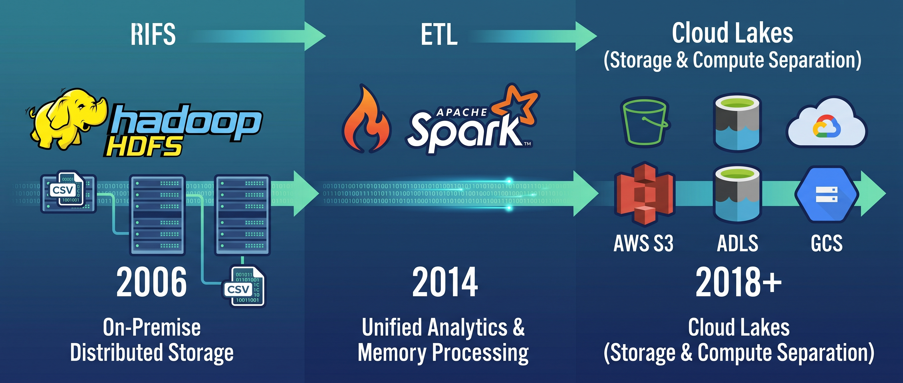
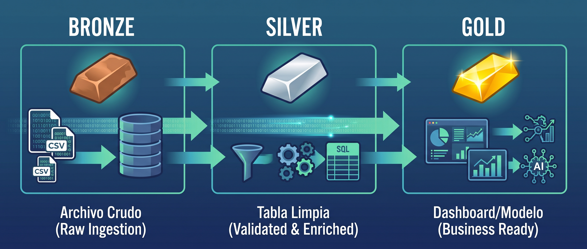
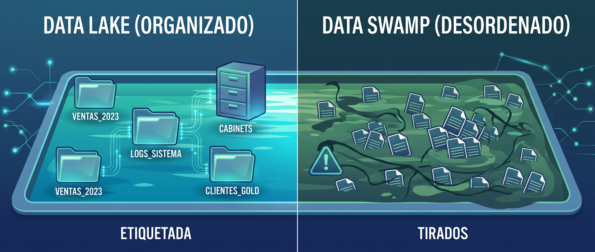

# Data Lake



## Contexto historico

A finales de los 2000s, el Data Warehouse llevaba mas de una decada funcionando bien para reportes de negocio. Pero el mundo empezo a generar datos que no cabian en su modelo:

| Tipo de dato | Por que no cabe en un Warehouse |
|---|---|
| Logs de servidores | Millones de lineas por dia, texto semi-estructurado |
| Datos de sensores IoT | Alta frecuencia, volumenes enormes, formatos variados |
| Redes sociales | Texto libre, imagenes, JSON anidado |
| Clickstream web | Cada click de cada usuario, petabytes al ano |
| Imagenes y video | Binarios, no son tablas |
| Datos de APIs externas | JSON con estructura variable |

El Warehouse exigia que todo fuera tabla con columnas fijas, limpio antes de entrar, y el almacenamiento era caro. Guardar petabytes de logs crudos "por si acaso" no era viable. Se necesitaba un lugar donde tirar todo a bajo costo y decidir despues que hacer con ello.

En 2010, **James Dixon** (CTO de Pentaho) acuno el termino "Data Lake" como contraposicion al Warehouse: en vez de un almacen ordenado donde todo tiene su lugar, un lago donde los rios (fuentes) depositan sus datos en su estado natural.

---

## Que es un Data Lake

Un Data Lake es un repositorio centralizado que almacena datos en su **formato original**, sin transformar ni estructurar. Puede contener datos estructurados (CSV, Parquet), semi-estructurados (JSON, XML, logs) y no estructurados (imagenes, audio, PDF).

Las caracteristicas que lo definen:

| Caracteristica | Que significa |
|---|---|
| **Almacenamiento crudo** | Los datos entran tal como llegan, sin limpieza ni transformacion |
| **Schema-on-Read** | El esquema se aplica cuando alguien lee los datos, no cuando se escriben |
| **Multi-formato** | CSV, JSON, Parquet, imagenes, audio, logs — todo convive |
| **Bajo costo** | Usa almacenamiento de objetos (S3, Azure Blob) que cuesta centavos por GB |
| **Escala horizontal** | Se puede escalar a petabytes sin redisenar la arquitectura |
| **Separacion almacenamiento-computo** | Los datos se guardan en un lugar, se procesan desde otro |

---

## Schema-on-Write vs Schema-on-Read

Esta es la diferencia fundamental entre Warehouse y Lake:




### Schema-on-Write (Warehouse)

```
Datos ──► Definir esquema ──► Limpiar ──► Validar ──► Escribir
          (antes de entrar)

Si no cumple el esquema, no entra.
Lento de configurar, pero todo lo de adentro es confiable.
```

### Schema-on-Read (Lake)

```
Datos ──► Escribir directo ──► (almacenado crudo)

                    ... tiempo despues ...

Leer ──► Aplicar esquema ──► Interpretar
         (al momento de usar)

Rapido de configurar, pero la calidad depende de quien lee.
```

La ventaja del Schema-on-Read es la velocidad: los datos estan disponibles en segundos, no en semanas. La desventaja es que cada persona que lee tiene que resolver los problemas de calidad por su cuenta, o peor — ni se da cuenta de que los datos tienen problemas.

---

## La era Hadoop

El primer Data Lake masivo se construyo sobre **Apache Hadoop**, un framework open-source para almacenar y procesar datos distribuidos:

| Componente | Que hace |
|---|---|
| **HDFS** (Hadoop Distributed File System) | Almacenamiento distribuido en un cluster de maquinas |
| **MapReduce** | Motor de procesamiento por lotes (batch) |
| **YARN** | Gestor de recursos del cluster |
| **Hive** | Interfaz SQL sobre archivos en HDFS |

Hadoop fue revolucionario: por primera vez se podia almacenar petabytes de datos en hardware commodity (servidores baratos) en vez de servidores especializados. Google, Yahoo, Facebook y LinkedIn fueron los primeros en adoptarlo.

Pero Hadoop tenia problemas:

| Problema | Consecuencia |
|---|---|
| MapReduce era lento | Horas para procesar un query que en SQL tardaba minutos |
| Dificil de operar | Requeria administradores especializados en el cluster |
| Solo procesamiento batch | No servia para consultas interactivas |
| Java pesado | Escribir un job de MapReduce era decenas de lineas de Java |

Estos problemas llevaron a la creacion de **Apache Spark** (2014), que reemplazo MapReduce con un motor de procesamiento en memoria 10-100x mas rapido, y eventualmente a la migracion de HDFS a almacenamiento en la nube (S3, Azure Blob, GCS), eliminando la necesidad de administrar un cluster Hadoop.

Hoy, muy pocas empresas nuevas instalan Hadoop. Usan S3 + Spark, o directamente servicios cloud. Pero el concepto de Data Lake que Hadoop popularizo sigue vigente.



---

## Arquitectura: zonas del Data Lake

Un Data Lake sin organizacion es un pantano. La practica estandar es dividirlo en **zonas** (tambien llamadas capas o medallion architecture) que representan el nivel de madurez de los datos:




### Zona Bronze (Raw)

Los datos llegan tal como estan. No se tocan, no se limpian, no se borran. Son la **fuente de verdad** — si algo sale mal en las capas superiores, siempre se puede volver a procesar desde Bronze.

```
bronze/
├── ventas/
│   ├── fuente=erp/
│   │   ├── 2024-06-01.csv
│   │   └── 2024-06-02.csv
│   └── fuente=crm/
│       └── leads_junio.json
├── logs/
│   └── server/
│       └── 2024-06-01.log
└── imagenes/
    └── productos/
        ├── prod_101.jpg
        └── prod_102.jpg
```

| Regla | Por que |
|---|---|
| Nunca modificar un archivo en Bronze | Si se corrompe la fuente de verdad, no hay como recuperar |
| Particionar por fecha de llegada | Para saber cuando llego cada archivo |
| Guardar metadata de origen | De donde vino, cuando, quien lo envio |

### Zona Silver (Processed)

Los datos de Bronze se limpian, tipan, deduplicany y estandarizan. El resultado es un dataset limpio en formato eficiente (Parquet). Todavia no esta modelado para un caso de uso especifico — es un dataset general limpio.

```
silver/
├── ventas/
│   └── ventas_consolidadas.parquet    # CSV + JSON unificados
│                                       # Columnas renombradas
│                                       # Tipos correctos
│                                       # Nulos tratados
│                                       # Duplicados eliminados
└── logs/
    └── logs_parseados.parquet          # Texto parseado a columnas
                                        # timestamp, nivel, usuario, accion
```

Aqui se aplica todo lo de la Unidad 1 (limpieza) y Unidad 2 (validacion, contratos).

### Zona Gold (Curated)

Los datos de Silver se modelan y agregan para un caso de uso especifico: un dashboard, un KPI, un modelo de ML. Es lo que consume el usuario final.

```
gold/
├── dashboard_ventas/
│   ├── resumen_regional.parquet       # Ingreso por region y mes
│   └── top_productos.parquet          # Ranking de productos
├── kpis/
│   └── kpis_mensuales.parquet         # MRR, churn, retencion
└── modelos/
    └── features_churn.parquet         # Features para modelo de churn
```

### Flujo completo

```
Fuentes ──► Bronze (crudo) ──► Silver (limpio) ──► Gold (listo para usar)
             │                    │                    │
             │                    │                    ├── Dashboards
             │                    │                    ├── Reportes
             │                    │                    └── Modelos ML
             │                    │
             │                    └── Analistas exploran aqui
             │
             └── Fuente de verdad (nunca se borra)
```

---

## Formatos de archivo en un Data Lake

El formato del archivo determina el rendimiento y las capacidades:

| Formato | Tipo | Compresion | Tipos preservados | Lectura selectiva columnas | Mejor para |
|---|---|---|---|---|---|
| **CSV** | Texto, filas | No | No | No (lee todo) | Intercambio simple, Excel |
| **JSON** | Texto, documentos | No | Parcial | No | APIs, datos semi-estructurados |
| **Parquet** | Binario, columnas | Si (snappy/gzip) | Si | Si (solo lee las columnas pedidas) | Analitica, Data Lakes, produccion |
| **Avro** | Binario, filas | Si | Si | No | Streaming, Kafka |
| **ORC** | Binario, columnas | Si | Si | Si | Hive, Hadoop legacy |

**Parquet** es el formato dominante en Data Lakes modernos por su combinacion de compresion, velocidad y lectura selectiva de columnas.


### Almacenamiento por filas vs por columnas

CSV guarda los datos por fila:

```
Ana, Bogota, 4500
Carlos, Medellin, 2400
Maria, Cali, 3500
```

Si solo necesitas la columna `ingreso`, CSV tiene que leer TODA la fila para llegar al tercer campo. Con millones de filas, eso es lento.

Parquet guarda los datos por columna:

```
[Ana, Carlos, Maria]          ← columna nombre
[Bogota, Medellin, Cali]      ← columna ciudad
[4500, 2400, 3500]            ← columna ingreso
```

Si solo necesitas `ingreso`, Parquet lee solo ese bloque. Con 50 columnas y solo necesitas 3, Parquet lee el 6% del archivo. CSV lee el 100%.

---

## Particionamiento

Cuando un dataset tiene millones de filas, conviene **particionarlo**: dividirlo en subcarpetas por una columna clave (fecha, region, categoria). Asi, una consulta que filtra por esa columna solo lee la particion relevante.

```
ventas/
├── anio=2023/
│   ├── mes=01/
│   │   └── part-00000.parquet     # Solo datos de enero 2023
│   ├── mes=02/
│   │   └── part-00000.parquet
│   └── ...
└── anio=2024/
    ├── mes=01/
    │   └── part-00000.parquet     # Solo datos de enero 2024
    └── ...
```

```python
# Sin particionamiento: lee TODAS las filas
df = pd.read_parquet("ventas/")

# Con particionamiento: lee solo junio 2024
df = pd.read_parquet("ventas/", filters=[("anio", "=", 2024), ("mes", "=", 6)])
```

| Sin particionamiento | Con particionamiento |
|---|---|
| Lee todo el dataset | Lee solo la carpeta relevante |
| 10 millones de filas | 500,000 filas (solo un mes) |
| 2 minutos | 5 segundos |

La columna de particion debe tener **baja cardinalidad** (pocos valores unicos). Fecha (por ano/mes) y region son buenas opciones. ID de cliente (miles de valores) no — crearia miles de carpetas con archivos diminutos.

---

## El problema: Data Swamp

Un Data Lake sin gobierno se convierte en un **Data Swamp** (pantano de datos): nadie sabe que hay, los datos no se pueden usar y el Lake se vuelve un cementerio de archivos.




### Sintomas del Data Swamp

| Sintoma | Ejemplo real |
|---|---|
| **Nadie sabe que hay** | "Hay un CSV de ventas en alguna carpeta, creo que lo subio Juan en 2022" |
| **Formatos inconsistentes** | Un archivo tiene columna `fecha`, otro tiene `date`, otro tiene `fch` |
| **Sin documentacion** | "Que significa la columna `cod_reg`? Nadie sabe, Juan se fue de la empresa" |
| **Datos duplicados** | El mismo archivo cargado 3 veces con nombres `ventas.csv`, `ventas_v2.csv`, `ventas_final.csv` |
| **Sin calidad** | Archivos corruptos, vacios, con encoding roto, nulos disfrazados |
| **Sin control de acceso** | Cualquiera puede subir, modificar o borrar archivos |
| **Sin metadata** | No se sabe cuando llego cada archivo, de donde vino, ni que tan fresco es |

### Como prevenirlo

| Practica | Que resuelve |
|---|---|
| **Zonas Bronze/Silver/Gold** | Separar crudo de limpio de listo para consumo |
| **Contratos de datos** (U 2.2) | Definir esquema, propietario, consumidores, SLA |
| **Validacion automatica** (U 2.1) | Rechazar datos que no cumplen el esquema |
| **Catalogo de datos** | Un registro centralizado de que datasets existen, que significan y quien los mantiene |
| **Nomenclatura estandar** | Reglas de nombres de carpetas y archivos |
| **Control de acceso** | Permisos por zona y por equipo |
| **Linaje de datos** (Data Lineage) | Rastrear de donde vino cada dato y por que transformaciones paso |

---

## Implementaciones

### En la nube

| Servicio | Proveedor | Caracteristicas |
|---|---|---|
| **Amazon S3** | AWS | El almacenamiento de objetos mas usado del mundo. Barato, escala infinita. La base de la mayoria de Lakes |
| **Azure Data Lake Storage (ADLS)** | Microsoft | Integrado con Databricks, Synapse y Power BI. Soporte nativo para jerarquia de directorios |
| **Google Cloud Storage (GCS)** | Google | Integrado con BigQuery. Multiples clases de almacenamiento por frecuencia de acceso |

### Local / open source

| Herramienta | Que hace |
|---|---|
| **MinIO** | Almacenamiento S3-compatible que corre en tu maquina o servidor. Ideal para montar un Lake local de desarrollo |
| **HDFS** | El sistema de archivos distribuido original de Hadoop. Ya poco usado para Lakes nuevos, pero sigue en empresas legacy |
| **Carpeta en disco** | Para aprendizaje y desarrollo, una carpeta organizada con Parquet funciona como un Lake local |

---

## Ventajas y desventajas

| Ventajas | Desventajas |
|---|---|
| Almacena cualquier tipo de dato | Sin gobierno se vuelve Data Swamp |
| Muy barato (centavos por GB en la nube) | No garantiza calidad ni consistencia por defecto |
| Flexible (no necesitas esquema previo) | No soporta transacciones ACID (Parquet puro) |
| Escala a petabytes sin redisenar | Consultas sobre datos crudos son lentas |
| Base para ML, analitica exploratoria y BI | Requiere herramientas adicionales para consultas SQL eficientes |
| Separacion almacenamiento-computo | Necesita gobernanza activa para no degradarse |
| Datos crudos siempre disponibles para reprocesar | La transformacion la hace cada consumidor (duplicacion de esfuerzo) |

---

## Cuando usar un Data Lake

**Si:**
- Necesitas almacenar datos de muchas fuentes y formatos a bajo costo
- No sabes de antemano que preguntas vas a hacer
- Necesitas datos crudos para ML o analisis exploratorio
- El volumen es grande (terabytes+) y el presupuesto es limitado
- Quieres desacoplar almacenamiento de procesamiento

**No:**
- Solo necesitas reportes SQL sobre datos estructurados (un Warehouse es mas simple)
- No tienes equipo para mantener gobernanza y zonas
- El volumen es pequeno y cabe en una base de datos normal
- Necesitas transacciones ACID sobre los datos (necesitas Delta Lake o un Lakehouse)

---

