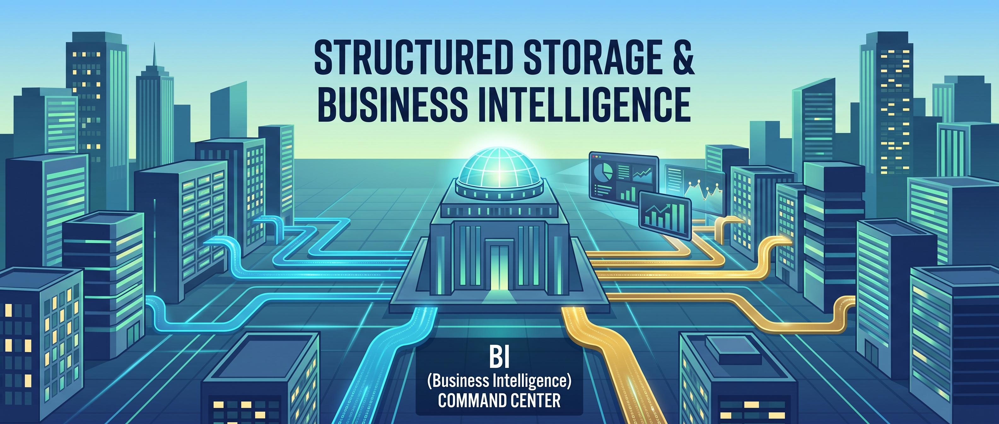
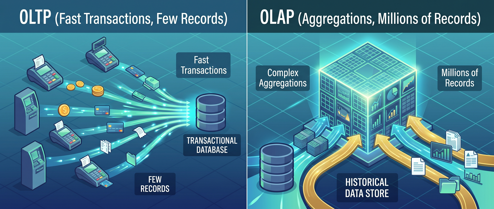
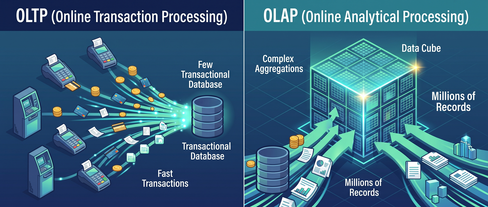
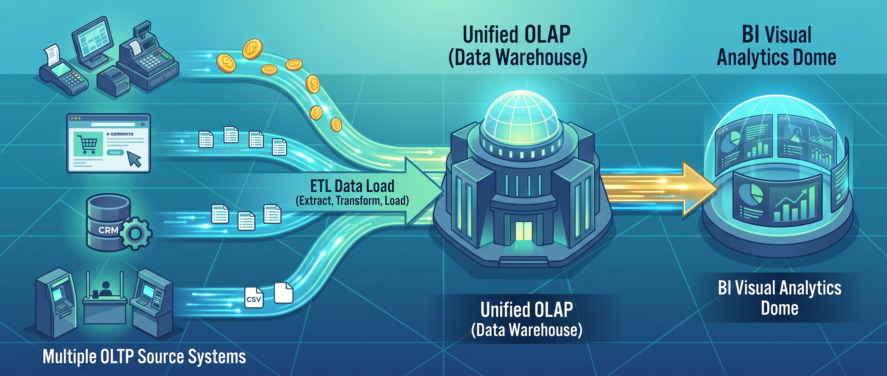
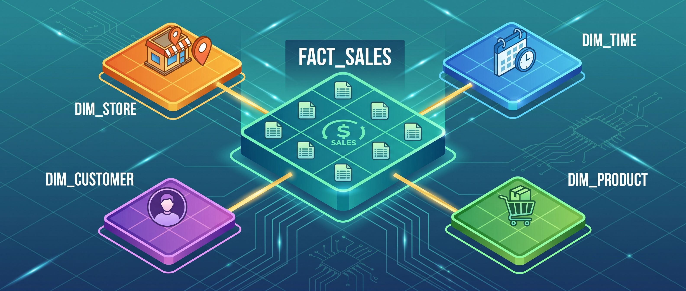

# Data Warehouse



## Contexto historico

En los 1980s y 1990s, las empresas operaban con sistemas transaccionales: un ERP para facturacion, un CRM para clientes, un sistema de inventario. Cada uno tenia su propia base de datos, optimizada para registrar operaciones rapidas — insertar una factura, actualizar un inventario, crear un pedido.

El problema aparecio cuando el gerente preguntaba: **"cual fue el ingreso por region en el ultimo trimestre?"** Esa pregunta requiere cruzar datos de facturacion, clientes y productos, recorrer millones de registros y hacer calculos de agregacion. Los sistemas transaccionales no estaban disenados para eso — una consulta analitica pesada podia tumbar el sistema de facturacion en produccion.

La solucion fue separar los dos mundos: un sistema para **operar** (OLTP) y otro para **analizar** (OLAP). El Data Warehouse es ese segundo sistema.




---

## Que es un Data Warehouse

Un Data Warehouse (almacen de datos) es un repositorio centralizado de datos **estructurados**, disenado exclusivamente para consultas analiticas y reportes de negocio. No es una base de datos operacional — no registra transacciones en tiempo real. Recibe copias de datos de multiples fuentes, los limpia, los transforma y los organiza en un esquema optimizado para responder preguntas de negocio.

Las caracteristicas que lo definen:

| Caracteristica | Que significa |
|---|---|
| **Orientado a temas** | Organizado por areas de negocio (ventas, clientes, inventario), no por aplicacion de origen |
| **Integrado** | Datos de multiples fuentes unificados en un solo formato y un solo esquema |
| **No volatil** | Los datos no se modifican ni se borran una vez cargados. Son historicos |
| **Variante en el tiempo** | Cada registro tiene una referencia temporal. Se puede analizar la evolucion |

Estas cuatro caracteristicas fueron definidas por **Bill Inmon** en 1992, considerado el padre del concepto Data Warehouse.

---

## OLTP vs OLAP

Antes de profundizar en el Warehouse, hay que entender la diferencia fundamental entre los dos tipos de sistemas:

| | OLTP (Transaccional) | OLAP (Analitico) |
|---|---|---|
| **Proposito** | Registrar operaciones del dia a dia | Responder preguntas de negocio |
| **Operaciones** | INSERT, UPDATE, DELETE rapidos | SELECT con GROUP BY, JOIN, agregaciones |
| **Usuarios** | Cajeros, vendedores, sistemas | Analistas, gerentes, dashboards |
| **Volumen por query** | Pocos registros (1 factura) | Millones de registros (todo el trimestre) |
| **Esquema** | Normalizado (3FN) — evitar redundancia | Desnormalizado (estrella) — optimizar consultas |
| **Datos** | Solo el estado actual | Historico (anos de datos) |
| **Ejemplo de pregunta** | "Cual es el saldo de esta cuenta?" | "Como evoluciono el ingreso por region en los ultimos 3 anos?" |
| **Ejemplo de sistema** | PostgreSQL, MySQL, Oracle, SAP | Snowflake, BigQuery, Redshift |

Un error comun es intentar hacer analitica directamente sobre la base de datos transaccional. Funciona con pocos datos, pero a escala las consultas analiticas compiten con las operacionales y el sistema se degrada.



---

## Schema-on-Write

El concepto central del Data Warehouse es **Schema-on-Write**: los datos se limpian, transforman y validan **antes** de escribirse. Si un registro no cumple el esquema (tipo incorrecto, valor fuera de rango, clave foranea inexistente), no entra.

Esto tiene una consecuencia importante: todo lo que esta dentro del Warehouse es confiable. No hay nulos disfrazados, no hay formatos inconsistentes, no hay duplicados. Pero tambien significa que agregar una fuente nueva es un proyecto de semanas — hay que entender la fuente, definir las transformaciones, construir el ETL y validar.

```
Fuentes                    ETL                        Warehouse
─────────            ──────────────────         ──────────────────
                     ┌─────────────┐
  ERP    ──────────► │  Extraer    │
                     │  del origen │
  CRM    ──────────► │             │            ┌────────────────┐
                     ├─────────────┤            │                │
  Excel  ──────────► │ Transformar │──────────► │  Datos limpios │
                     │ (limpiar,   │            │  Esquema fijo  │
  APIs   ──────────► │  tipar,     │            │  Historico     │
                     │  deduplicar)│            │                │
                     ├─────────────┤            └───────┬────────┘
                     │  Cargar     │                    │
                     │  al Warehouse│                   ▼
                     └─────────────┘            Reportes, BI,
                                                Dashboards
```

---

## Modelado dimensional: Kimball vs Inmon

Hay dos escuelas de pensamiento para disenar un Warehouse:

### Ralph Kimball: Bottom-Up (Dimensional)

Construir Data Marts (pequenos warehouses por area de negocio) y conectarlos. El enfoque mas popular y practico. Usa el **modelo dimensional** con esquema estrella.

| Concepto | Que es |
|---|---|
| **Data Mart** | Un Warehouse pequeno enfocado en un area: ventas, finanzas, RRHH |
| **Tabla de hechos** | La tabla central con las metricas (ingreso, unidades, costo) |
| **Tabla de dimension** | Tablas de contexto (producto, region, fecha, cliente) |
| **Granularidad** | El nivel de detalle de cada fila: una transaccion, un dia, un mes |
| **Bus Architecture** | Dimensiones compartidas entre Data Marts (misma dim_fecha para todos) |

### Bill Inmon: Top-Down (Enterprise)

Construir un Warehouse corporativo completo primero (normalizado en 3FN), y luego derivar Data Marts de el. Mas riguroso pero mas lento de implementar.

| | Kimball | Inmon |
|---|---|---|
| Enfoque | Bottom-Up | Top-Down |
| Primero construyes | Data Marts por area | Warehouse corporativo completo |
| Esquema | Estrella (desnormalizado) | 3FN (normalizado) |
| Tiempo de implementacion | Semanas-meses | Meses-anos |
| Flexibilidad | Alta (agregas marts) | Baja (cambiar el modelo central es costoso) |
| Mas usado en | La mayoria de empresas | Grandes corporaciones con presupuesto |

En la practica, **Kimball es el enfoque dominante** por su practicidad. Es lo que usan Snowflake, BigQuery y la mayoria de herramientas modernas.

---

## Esquema Estrella

El esquema estrella es la forma clasica de organizar datos en un Warehouse. Tiene una tabla central de **hechos** rodeada de tablas de **dimensiones**.




### Tabla de hechos

La tabla mas grande del Warehouse. Cada fila representa un **evento medible**: una venta, un envio, un click, una llamada. Contiene:

- **Claves foraneas** a las dimensiones (fecha_id, producto_id, region_id)
- **Metricas** numéricas (ingreso, unidades, costo, duracion)

Las metricas pueden ser:

| Tipo | Descripcion | Ejemplo |
|---|---|---|
| **Aditiva** | Se puede sumar en cualquier dimension | Ingreso (sumar por region, por mes) |
| **Semi-aditiva** | Se puede sumar en algunas dimensiones | Saldo de cuenta (sumar por cliente, no por tiempo) |
| **No aditiva** | No se puede sumar, solo promediar o contar | Porcentaje de descuento, temperatura |

### Tablas de dimension

Tablas pequenas que describen el **contexto** de los hechos. Responden las preguntas "quien", "que", "donde", "cuando":

| Dimension | Atributos tipicos | Para que sirve |
|---|---|---|
| **dim_fecha** | Fecha, dia de semana, mes, trimestre, ano, festivo | Analizar por periodo temporal |
| **dim_producto** | Nombre, categoria, subcategoria, marca, precio lista | Analizar por tipo de producto |
| **dim_region** | Ciudad, departamento, pais, zona, coordenadas | Analizar por geografia |
| **dim_cliente** | Nombre, segmento, canal, fecha registro | Analizar por tipo de cliente |
| **dim_vendedor** | Nombre, equipo, fecha ingreso, meta | Analizar por fuerza comercial |

La **dimension fecha** es especial: casi siempre existe y tiene atributos precalculados (es festivo? es fin de semana? que trimestre?) que facilitan los reportes.

### Ejemplo concreto

```
                     ┌──────────────────┐
                     │   dim_producto    │
                     │──────────────────│
                     │ producto_id (PK) │
                     │ nombre           │
                     │ categoria        │
                     │ precio_lista     │
                     └────────┬─────────┘
                              │
┌──────────────────┐  ┌───────▼──────────┐  ┌──────────────────┐
│   dim_fecha       │  │  hechos_ventas   │  │   dim_region     │
│──────────────────│  │─────────────────│  │──────────────────│
│ fecha_id (PK)    │──│ fecha_id (FK)    │──│ region_id (PK)   │
│ fecha            │  │ producto_id (FK) │  │ ciudad           │
│ mes              │  │ region_id (FK)   │  │ departamento     │
│ trimestre        │  │ cliente_id (FK)  │  │ zona             │
│ ano              │  │──── metricas ────│  └──────────────────┘
│ dia_semana       │  │ unidades         │
│ es_festivo       │  │ ingreso          │  ┌──────────────────┐
└──────────────────┘  │ costo            │  │   dim_cliente    │
                      │ descuento        │──│──────────────────│
                      └──────────────────┘  │ cliente_id (PK)  │
                                            │ nombre           │
                                            │ segmento         │
                                            │ canal            │
                                            └──────────────────┘
```

Una consulta tipica sobre este esquema:

```sql
SELECT
    r.ciudad,
    p.categoria,
    f.trimestre,
    SUM(v.ingreso) AS ingreso_total,
    SUM(v.unidades) AS unidades_vendidas,
    COUNT(DISTINCT v.cliente_id) AS clientes_unicos
FROM hechos_ventas v
JOIN dim_producto p ON v.producto_id = p.producto_id
JOIN dim_region r ON v.region_id = r.region_id
JOIN dim_fecha f ON v.fecha_id = f.fecha_id
WHERE f.ano = 2024
GROUP BY r.ciudad, p.categoria, f.trimestre
ORDER BY ingreso_total DESC;
```

---

## Esquema Copo de Nieve (Snowflake Schema)

Una variante del esquema estrella donde las dimensiones se normalizan: en vez de una tabla `dim_producto` con la categoria como columna, se crea una tabla separada `dim_categoria` que se une a `dim_producto`.

```
dim_categoria ──► dim_producto ──► hechos_ventas ◄── dim_region ◄── dim_zona
                                        │
                                   dim_fecha
```

| | Estrella | Copo de nieve |
|---|---|---|
| Dimensiones | Planas (desnormalizadas) | Normalizadas (subdivididas) |
| Numero de tablas | Menos | Mas |
| Consultas | Mas simples (menos JOINs) | Mas complejas (mas JOINs) |
| Redundancia | Hay duplicacion | Sin duplicacion |
| Rendimiento | Mas rapido (menos JOINs) | Mas lento |
| Uso en la practica | Dominante | Poco usado |

En la practica, el esquema estrella es preferido porque las herramientas de BI (Power BI, Tableau, Looker) estan optimizadas para el y las consultas son mas simples.

---

## El proceso ETL

ETL (Extract, Transform, Load) es el pipeline que alimenta el Warehouse:




### Extract (Extraer)

Conectarse a las fuentes y traer los datos:

| Fuente | Metodo de extraccion |
|---|---|
| Base de datos | Query SQL, replicacion, CDC (Change Data Capture) |
| Archivo | Leer CSV, Excel, JSON de un servidor o nube |
| API | Request HTTP, paginacion |
| Streaming | Kafka, Kinesis, Event Hub |

La extraccion puede ser **full** (todo cada vez) o **incremental** (solo lo nuevo desde la ultima carga). Incremental es mas eficiente pero mas complejo.

### Transform (Transformar)

Limpiar y preparar los datos para el esquema del Warehouse:

| Transformacion | Ejemplo |
|---|---|
| Limpiar nulos | Reemplazar DESCONOCIDO por NULL |
| Convertir tipos | String "2024-06-01" a DATE |
| Deduplicar | Eliminar registros repetidos |
| Estandarizar | "Bogota", "BOGOTA", "Bogotá" → "Bogota" |
| Calcular metricas | ingreso = unidades × precio |
| Mapear claves | Reemplazar nombre de producto por producto_id |
| Validar | Rechazar registros con precio negativo |

Todo lo que aprendimos en las Unidades 1 y 2 (limpieza, validacion, normalizacion) es exactamente lo que pasa en la fase Transform del ETL.

### Load (Cargar)

Escribir los datos transformados en el Warehouse:

| Tipo de carga | Que hace | Cuando usarla |
|---|---|---|
| **Full refresh** | Borra todo y recarga | Tablas pequenas, dimensiones |
| **Append** | Agrega filas nuevas | Hechos historicos |
| **Upsert** | Actualiza existentes, inserta nuevos | Dimensiones que cambian (SCD) |

---

## Slowly Changing Dimensions (SCD)

Las dimensiones no son estaticas. Un cliente cambia de ciudad, un producto cambia de precio, un vendedor cambia de equipo. Como manejar esos cambios?

| Tipo | Que hace | Ejemplo |
|---|---|---|
| **SCD Tipo 0** | No cambia nunca | Fecha de nacimiento |
| **SCD Tipo 1** | Sobreescribe el valor | El cliente cambio de ciudad: se actualiza la fila. Se pierde el historial |
| **SCD Tipo 2** | Crea una nueva fila con fechas de vigencia | El cliente tiene 2 filas: una vigente y una historica. Se conserva el historial |
| **SCD Tipo 3** | Agrega una columna con el valor anterior | `ciudad_actual` y `ciudad_anterior`. Limitado a 1 cambio |

El **Tipo 2** es el mas comun en Warehouses que necesitan analisis historico:

```
cliente_id  nombre    ciudad      vigente_desde  vigente_hasta  es_actual
1001        Ana       Medellin    2020-01-01     2023-06-30     No
1001        Ana       Bogota      2023-07-01     9999-12-31     Si
```

Asi puedes saber que las ventas de Ana en 2022 corresponden a Medellin y las de 2024 a Bogota.

---

## Ventajas y desventajas

| Ventajas | Desventajas |
|---|---|
| Datos siempre limpios y confiables | Costoso (almacenamiento + licencias + equipo) |
| Consultas SQL rapidas (datos preorganizados) | Rigido (cambiar el esquema es un proyecto) |
| Ideal para reportes de negocio y BI | Solo datos estructurados (no imagenes, no logs) |
| Tecnologia madura, documentada, estable | ETL largo: semanas para agregar una fuente nueva |
| Historico completo con SCD | Requiere equipo especializado |
| Estandar en la industria desde hace 30 anos | No sirve para ML o datos no estructurados |

---

## Ejemplos en la industria

| Herramienta | Tipo | Caracteristica principal |
|---|---|---|
| **Snowflake** | Cloud | Separacion de almacenamiento y computo, escalado automatico |
| **Google BigQuery** | Cloud | Serverless, pago por consulta, no hay infraestructura que manejar |
| **Amazon Redshift** | Cloud | Integrado con el ecosistema AWS |
| **Azure Synapse** | Cloud | Integrado con Power BI y el ecosistema Microsoft |
| **Teradata** | On-premise | El clasico enterprise, grandes corporaciones |
| **PostgreSQL** | Open source | Puede funcionar como Warehouse pequeno con buenas practicas |
| **DuckDB** | Embebido | Warehouse analitico en un solo archivo, ideal para analisis local |

---

## Cuando usar un Data Warehouse

**Si:**
- Los datos son estructurados (tablas con columnas fijas)
- Las consultas son predecibles (reportes mensuales, KPIs fijos)
- La confiabilidad importa mas que la flexibilidad
- El equipo de negocio necesita SQL y BI
- Se necesita historial (como evoluciono esta metrica en 3 anos)

**No:**
- Los datos son no estructurados (imagenes, audio, texto libre)
- No se sabe que preguntas se van a hacer (exploracion abierta)
- Se necesita ML sobre datos crudos
- El presupuesto es limitado y el volumen es muy grande
- Los datos cambian de estructura frecuentemente

---

