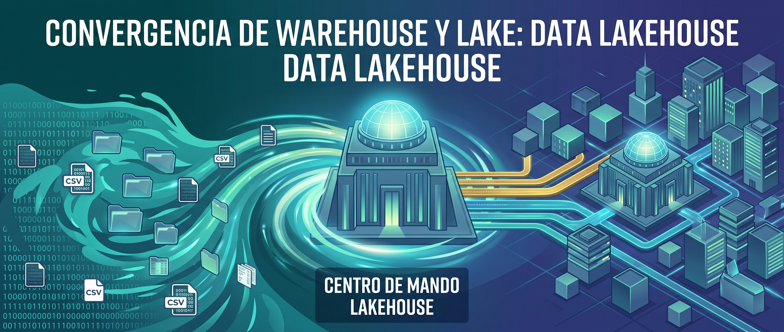
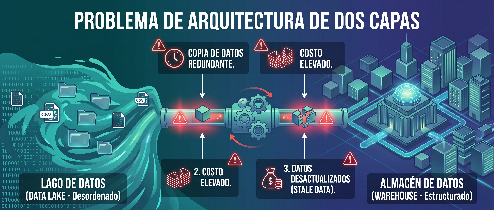
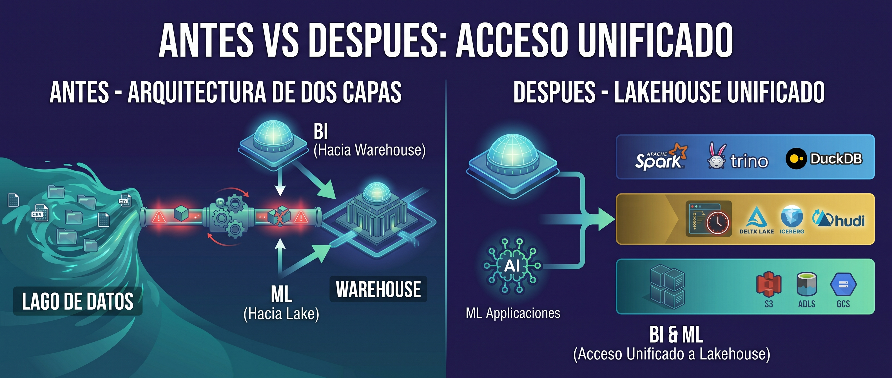
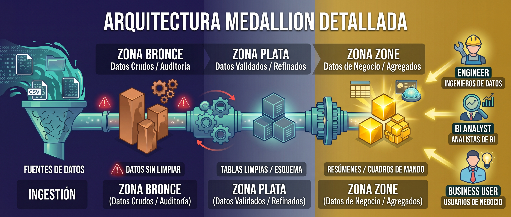

# Lakehouse




## Contexto historico

Durante la decada de 2010, la arquitectura dominante en empresas grandes era la **arquitectura de dos capas**: un Data Lake para almacenar todo crudo a bajo costo, y un Data Warehouse separado para hacer BI y reportes.




El flujo era:

```
Fuentes ──► Data Lake (crudo, S3) ──► ETL ──► Data Warehouse (limpio, Snowflake)
                │                                        │
                └──► ML (sobre datos crudos)              └──► BI (reportes, dashboards)
```

Esto funcionaba pero tenia problemas serios:

| Problema | Consecuencia |
|---|---|
| **Copia de datos** | Los mismos datos existen en dos lugares (Lake y Warehouse), duplicando el costo de almacenamiento |
| **Datos desincronizados** | El ETL entre Lake y Warehouse tiene latencia. El dashboard puede mostrar datos de ayer mientras el modelo de ML usa datos de hoy |
| **Doble mantenimiento** | Dos sistemas para administrar, dos equipos, dos presupuestos, dos sets de permisos |
| **ML aislado** | Los cientificos de datos trabajan sobre el Lake con datos crudos, los analistas de BI sobre el Warehouse con datos limpios. Ven datos diferentes |
| **Costo compuesto** | Pagas almacenamiento en el Lake Y licencias del Warehouse Y computo del ETL que mueve datos entre ellos |
| **Latencia** | Agregar una fuente nueva requiere configurar la ingesta al Lake, luego el ETL al Warehouse. Semanas de trabajo |

En 2020, **Databricks** publico el paper ["Lakehouse: A New Generation of Open Platforms"](https://www.cidrdb.org/cidr2021/papers/cidr2021_paper17.pdf) proponiendo eliminar la segunda capa: poner las capacidades del Warehouse directamente sobre el almacenamiento barato del Lake.

---

## Que es un Lakehouse

Un Lakehouse es una arquitectura que combina:

- **Almacenamiento del Data Lake**: archivos Parquet en almacenamiento de objetos (S3, ADLS, GCS), barato y escalable
- **Capacidades del Data Warehouse**: esquema, transacciones ACID, SQL rapido, governance, indices

La clave es una **capa de metadata** (implementada por Delta Lake, Apache Iceberg o Apache Hudi) que se sienta sobre los archivos y les agrega las capacidades que el Lake no tenia.

| Caracteristica | Warehouse | Lake | Lakehouse |
|---|---|---|---|
| Almacenamiento | Propietario, caro | Objetos, barato | Objetos, barato |
| Esquema | Obligatorio (write) | No tiene | Opcional, enforceable |
| Transacciones ACID | Si | No | Si |
| Tipos de dato | Solo estructurado | Todos | Todos |
| SQL | Nativo, rapido | Lento o limitado | Nativo sobre archivos |
| Machine Learning | Hay que sacar los datos | Directo sobre raw | Directo, mismos datos que BI |
| Time travel | No (en la mayoria) | No | Si |
| Costo | Alto | Bajo | Bajo-Medio |
| Copia de datos | N/A | Hay que copiar al Warehouse | No se copia |
| Gobernanza | Integrada | Manual o inexistente | Integrada via metadata |

---

## Arquitectura

El Lakehouse tiene tres capas, cada una con una responsabilidad clara:


### Capa 1: Almacenamiento (la base)

Archivos en almacenamiento de objetos. Es identico a un Data Lake: S3, ADLS, GCS, MinIO. Los datos viven como archivos Parquet organizados en carpetas. Barato, duradero, escalable.

```
s3://mi-lakehouse/
├── bronze/
│   ├── ventas/
│   ├── logs/
│   └── apis/
├── silver/
│   ├── ventas_limpias/
│   └── logs_parseados/
└── gold/
    ├── dashboard_ventas/
    └── kpis/
```

Esta capa no sabe nada de esquemas ni transacciones. Solo guarda archivos.

### Capa 2: Metadata (el cerebro)

Es lo que convierte un Lake en un Lakehouse. Una capa de software que agrega:

| Capacidad | Que hace | Como funciona |
|---|---|---|
| **Esquema** | Define que columnas y tipos tiene cada tabla | Metadata en JSON junto a los archivos Parquet |
| **Transacciones ACID** | Garantiza que las escrituras son atomicas | Log de transacciones (_delta_log, metadata/) |
| **Time travel** | Permite leer versiones anteriores de una tabla | Cada operacion crea una version numerada |
| **Schema enforcement** | Rechaza datos que no cumplen el esquema | Valida contra el esquema antes de escribir |
| **Particionamiento** | Organiza datos en subcarpetas por columna | Metadata track de que particiones existen |
| **Estadisticas** | Min/max por columna por archivo | Permite saltar archivos que no tienen datos relevantes (data skipping) |
| **Merge/Upsert** | Actualizar registros existentes | Lee, modifica en memoria, escribe nuevos archivos |
| **Linaje** | Rastrea de donde vino cada dato | Historial de operaciones en el log |

Las tres implementaciones principales de esta capa son:

| Tecnologia | Creador | Fortaleza |
|---|---|---|
| **Delta Lake** | Databricks | La mas popular. Madura, gran comunidad, integracion con Spark |
| **Apache Iceberg** | Netflix → Apache | Mejor rendimiento en tablas muy grandes. Soporte multi-motor (Spark, Trino, Flink) |
| **Apache Hudi** | Uber → Apache | Optimizado para upserts y datos en streaming |

Las tres resuelven el mismo problema fundamental con enfoques ligeramente distintos. En la practica, Delta Lake domina por su asociacion con Databricks y Spark.

### Capa 3: Consulta (la interfaz)

Los motores que leen y procesan los datos a traves de la capa de metadata:

| Motor | Tipo | Nota |
|---|---|---|
| **Apache Spark** | Distribuido | El mas usado. Escala a petabytes. Python (PySpark), Scala, SQL |
| **Trino (ex-Presto)** | SQL distribuido | Consultas SQL interactivas sobre el Lake. Creado por Facebook |
| **DuckDB** | Embebido | Motor analitico en un solo proceso. Ideal para desarrollo local |
| **Dremio** | SQL federado | Motor SQL que conecta multiples fuentes incluyendo Lakes |
| **Databricks SQL** | Serverless | SQL warehouse en la nube sobre Delta Lake |

---

## El problema que resuelve: unificacion

### Antes (dos sistemas)

```
                    ┌─────────────────┐
Fuentes ──► Lake ──►│  ETL pesado     │──► Warehouse ──► BI (dashboards)
             │      │  (copia datos)  │
             │      └─────────────────┘
             │
             └──► ML (datos crudos, posiblemente distintos a los de BI)
```

Problemas:
- BI y ML ven datos diferentes
- Cambiar un esquema requiere actualizar Lake, ETL y Warehouse
- Un dato tarda horas en ir de la fuente al dashboard

### Despues (Lakehouse)

```
                    ┌─────────────────────────┐
Fuentes ──► Lake ──►│  Capa de metadata       │──► BI (SQL directo sobre archivos)
                    │  (Delta/Iceberg/Hudi)   │
                    │                         │──► ML (mismos datos, misma tabla)
                    │  Sin copiar datos       │
                    └─────────────────────────┘
```

Ventajas:
- BI y ML ven exactamente los mismos datos
- Un solo esquema, un solo set de permisos
- Los datos estan disponibles en minutos, no horas
- No hay ETL de copia entre Lake y Warehouse



---

## Capacidades clave

### 1. SQL sobre archivos

Con un Lakehouse, puedes hacer consultas SQL directamente sobre archivos Parquet almacenados en S3 o Azure Blob, con rendimiento comparable a un Warehouse:

```sql
-- Esto corre sobre archivos Parquet en S3, no sobre una base de datos
SELECT
    region,
    producto,
    SUM(ingreso) AS ingreso_total,
    COUNT(*) AS transacciones
FROM silver.ventas
WHERE fecha >= '2024-01-01'
GROUP BY region, producto
ORDER BY ingreso_total DESC;
```

El truco esta en las **estadisticas a nivel de archivo**: la capa de metadata sabe que el archivo `part-00003.parquet` solo tiene datos de la region "Cali" con fechas de marzo. Si tu query filtra por region = "Bogota" y fecha en junio, ese archivo se salta completamente. Esto se llama **data skipping** y es lo que hace que las consultas sobre archivos sean rapidas.

### 2. BI y ML unificados

| En dos capas | En Lakehouse |
|---|---|
| El analista de BI ve la tabla `warehouse.ventas` en Snowflake | El analista ve `gold.ventas` sobre Delta Lake |
| El cientifico de datos ve `s3://lake/raw/ventas/*.csv` | El cientifico ve la misma `gold.ventas`, o `silver.ventas` si necesita mas detalle |
| Si el ETL tiene un bug, las tablas muestran datos distintos | Los dos ven la misma tabla, siempre consistente |

### 3. Streaming + Batch unificados

Un Lakehouse puede recibir datos en batch (archivos cada hora) y en streaming (eventos en tiempo real) en la misma tabla:

```
Fuente batch (CSV diario) ──┐
                             ├──► Tabla Delta ──► Dashboard actualizado
Fuente streaming (Kafka)  ──┘                     en minutos
```

Con la arquitectura de dos capas, el streaming iba por un lado (Kafka → base de datos operacional) y el batch por otro (archivos → Lake → Warehouse). Dos pipelines, dos sistemas, dos verdades.

### 4. Gobernanza integrada

La capa de metadata permite controlar:

| Aspecto | Como funciona |
|---|---|
| **Permisos** | Control de acceso a nivel de tabla, columna o fila |
| **Auditoria** | Historial de quien leyo o modifico cada tabla |
| **Linaje** | De donde vino cada columna, por que transformaciones paso |
| **Calidad** | Validaciones automaticas al escribir (expectations) |
| **Catalogo** | Registro centralizado de todas las tablas con descripcion |

---

## Medallion Architecture en el Lakehouse

La organizacion en zonas Bronze/Silver/Gold que vimos en el Data Lake se formaliza en el Lakehouse como la **Medallion Architecture**:




| Capa | Formato | Esquema | Calidad | Quien la usa |
|---|---|---|---|---|
| **Bronze** | Parquet/Delta (append only) | Schema-on-Read | Crudo, sin validar | Ingenieros de datos |
| **Silver** | Delta (con schema enforcement) | Esquema definido | Limpio, tipado, validado | Analistas, cientificos |
| **Gold** | Delta (modelado dimensional) | Estrella o desnormalizado | Agregado, listo para consumo | Negocio, dashboards |

La diferencia con un Lake puro: en el Lakehouse, cada capa es una **tabla Delta** (o Iceberg), no solo carpetas con archivos. Eso significa que cada capa tiene esquema, versionado y ACID.

---

## Implementaciones comerciales

| Plataforma | Capa metadata | Motor | Nota |
|---|---|---|---|
| **Databricks** | Delta Lake | Spark | El creador del concepto. La plataforma mas completa |
| **AWS (Lake Formation + Athena)** | Iceberg/Delta | Athena, EMR | Serverless SQL sobre S3 |
| **Azure (Synapse + Fabric)** | Delta Lake | Synapse Spark | Integrado con Power BI. Microsoft Fabric es la version nueva |
| **Google (BigLake)** | Iceberg | BigQuery | Unifica BigQuery con archivos en GCS |
| **Snowflake** | Iceberg | Snowflake | Originalmente solo Warehouse, ahora soporta Lakehouse con Iceberg |
| **Dremio** | Iceberg | Dremio | Open source, motor SQL sobre el Lake |
| **StarRocks** | Iceberg/Delta/Hudi | StarRocks | Motor analitico de alto rendimiento |

### Para aprendizaje y desarrollo local

| Herramienta | Lo que necesitas |
|---|---|
| **PySpark + Delta Lake** | `pip install pyspark delta-spark`. Corre local, misma API que en produccion |
| **DuckDB + Delta** | `pip install duckdb deltalake`. Motor SQL embebido, cero configuracion |
| **Polars + Delta** | `pip install polars deltalake`. Alternativa a pandas, soporte nativo Delta |
| **Carpeta local** | Parquet en carpetas Bronze/Silver/Gold. Sin ACID pero sirve para aprender la estructura |

---

## Ventajas y desventajas

| Ventajas | Desventajas |
|---|---|
| Costo de Lake + confiabilidad de Warehouse | Mas complejo de configurar que un Warehouse puro |
| BI y ML sobre los mismos datos sin copiar | Requiere Spark u otro motor para consultas grandes |
| SQL rapido sobre archivos gracias a metadata | Tecnologia relativamente nueva (Delta 2019, Iceberg 2020) |
| Open source en su mayoria (Delta, Iceberg, Hudi) | Rendimiento de SQL depende de la optimizacion (particiones, estadisticas) |
| Escala a petabytes sobre almacenamiento barato | Menos herramientas de BI estan integradas directamente (vs Snowflake que tiene ecosistema maduro) |
| Gobernanza integrada (permisos, auditoria, linaje) | Requiere equipo con conocimiento de infraestructura distribuida |
| Streaming + batch en la misma tabla | El ecosistema esta fragmentado (Delta vs Iceberg vs Hudi) |

---

## Cuando usar un Lakehouse

**Si:**
- Necesitas hacer BI (SQL, dashboards) y ML (modelos, features) sobre los mismos datos
- Quieres eliminar la copia de datos entre Lake y Warehouse
- El volumen es grande (terabytes+) y quieres almacenamiento barato
- Necesitas transacciones ACID, time travel o control de esquema
- Tu equipo tiene experiencia con Spark o esta dispuesto a aprenderlo
- Estas empezando un proyecto nuevo y quieres una arquitectura moderna

**No:**
- Solo necesitas BI simple y ya tienes un Warehouse funcionando (no vale la pena migrar)
- El volumen es pequeno y cabe en PostgreSQL o BigQuery sin problema
- No tienes equipo tecnico para administrar Spark y la capa de metadata
- Tus datos son 100% estructurados y no necesitas ML (un Warehouse puro es mas simple)

---

## Lakehouse vs cada alternativa

### vs Data Warehouse

| | Warehouse | Lakehouse |
|---|---|---|
| Costo | Alto | Bajo (almacenamiento) + medio (computo) |
| Datos no estructurados | No soporta | Si soporta |
| ML | Hay que exportar los datos | Directo sobre las tablas |
| Madurez | 30+ anos | ~5 anos |
| Simplicidad | Mas simple para BI puro | Mas complejo de configurar |

**Veredicto:** si solo necesitas BI y el presupuesto no es problema, el Warehouse es mas simple. Si necesitas BI + ML o el costo importa, Lakehouse gana.

### vs Data Lake

| | Lake | Lakehouse |
|---|---|---|
| ACID | No | Si |
| Esquema | No tiene | Enforceable |
| SQL | Lento, limitado | Rapido con metadata |
| Gobernanza | Manual | Integrada |
| Costo | Identico | Identico (mismos archivos) |

**Veredicto:** un Lakehouse es un Lake con superpoderes. Si ya tienes un Lake, agregar Delta o Iceberg lo convierte en Lakehouse sin mover datos.

---
