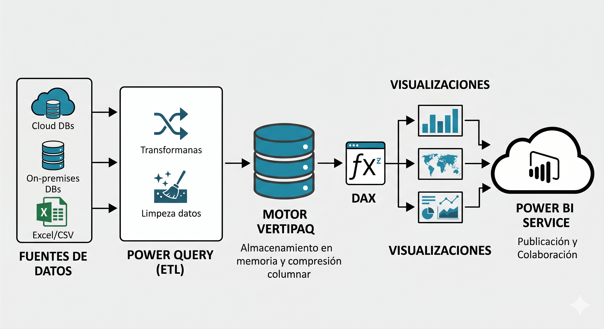
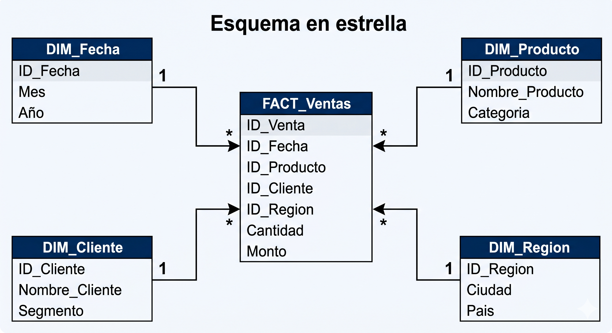
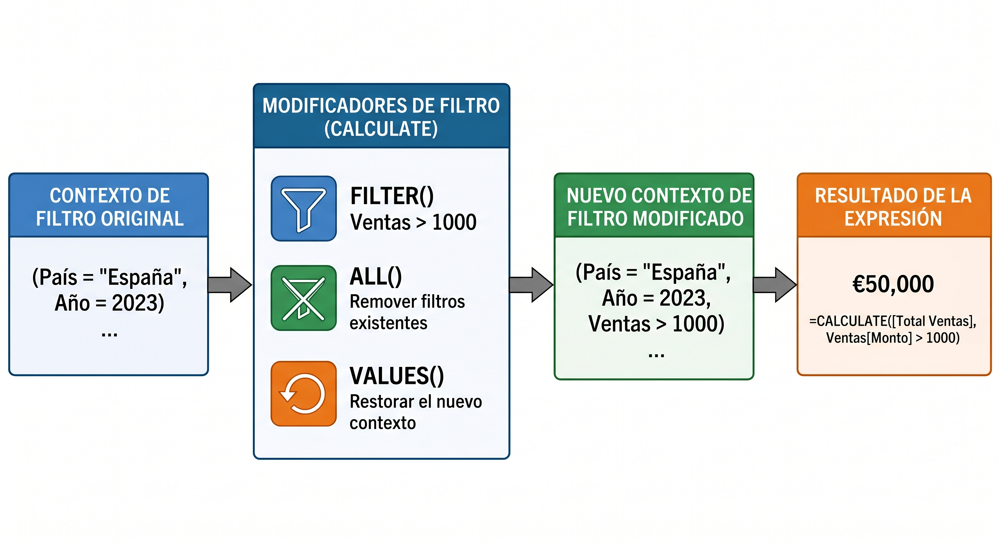
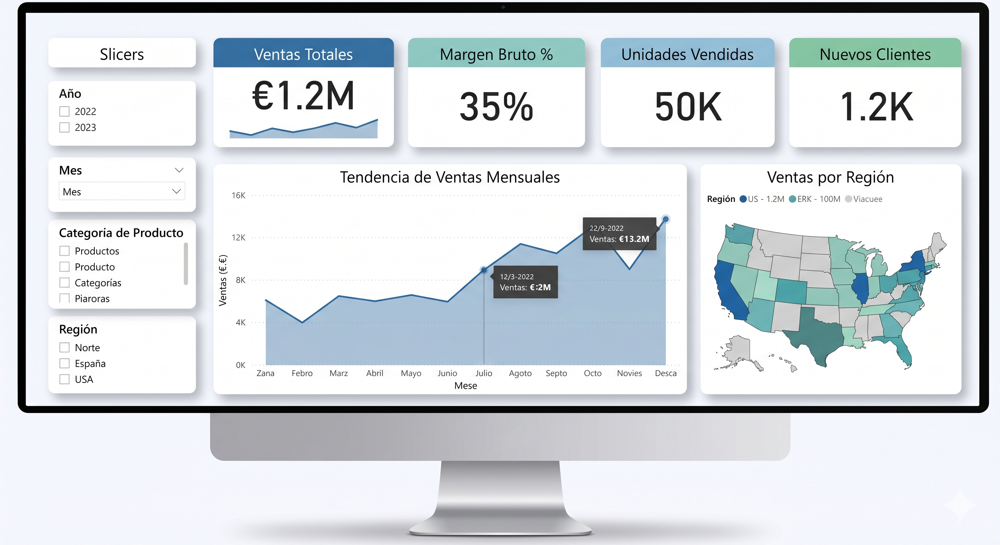
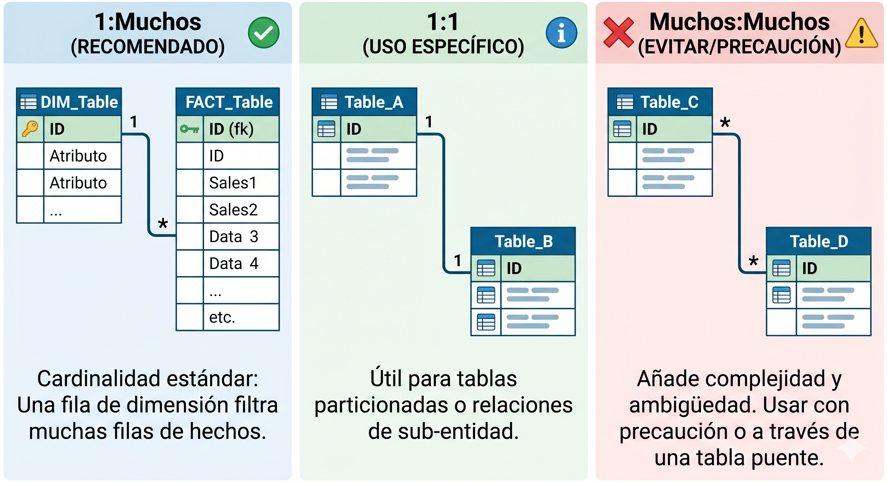

# Unidad 3 Visualizacion con Power BI

## Indice

1. [Arquitectura y ecosistema](#1-arquitectura-y-ecosistema)
2. [Flujo de trabajo en Power BI](#2-flujo-de-trabajo)
3. [Power Query: transformacion de datos](#3-power-query)
4. [Modelado de datos](#4-modelado-de-datos)
5. [DAX: Data Analysis Expressions](#5-dax)
6. [Medidas y columnas calculadas](#6-medidas-y-columnas-calculadas)
7. [Visualizaciones](#7-visualizaciones)
8. [Filtros y segmentadores](#8-filtros-y-segmentadores)
9. [Temas y diseño](#9-temas-y-diseño)
10. [Power BI Service y colaboracion](#10-power-bi-service)
11. [DAX avanzado: inteligencia de tiempo](#11-dax-avanzado)
12. [Buenas practicas](#12-buenas-practicas)
13. [Referencias](#13-referencias)

---

## 1. Arquitectura y Ecosistema

### 1.1 Componentes del ecosistema

```
Fuentes de datos
  (Excel, SQL, CSV, APIs, SharePoint, Azure...)
          ↓
   Power Query (ETL)
          ↓
   Motor Vertipaq (columnar, comprimido en RAM)
          ↓
   Modelo de datos (tablas + relaciones)
          ↓
   DAX (calculos y medidas)
          ↓
   Visualizaciones (reportes interactivos)
          ↓
   Power BI Service (nube) → Dashboards, Apps, Alertas
```

### 1.2 Las tres herramientas principales

| Herramienta | Descripcion | Uso |
|-------------|-------------|-----|
| **Power BI Desktop** | Aplicacion Windows gratuita | Construir reportes |
| **Power BI Service** | Plataforma web (powerbi.com) | Publicar, compartir, colaborar |
| **Power BI Mobile** | App iOS / Android | Consumir reportes |

### 1.3 Motor Vertipaq

El motor de almacenamiento de Power BI es **Vertipaq**, un motor columnar en memoria (IMDB — In-Memory Database):

- Almacena los datos **por columna**, no por fila.
- Aplica **compresion por diccionario**: reemplaza valores repetidos por indices enteros.
- Compresion tipica: 10:1 a 100:1 sobre el dato original.
- Todas las consultas DAX pasan por Vertipaq, que ejecuta en multiples hilos.

**Por que columnar es mas rapido para analitica:**

```
Tabla tradicional (row-store):
  Fila1: [2024-01, Norte, 1200, 0.15]
  Fila2: [2024-01, Sur,   980,  0.12]
  ...

  SUM(Ventas) -> leer TODAS las columnas de TODAS las filas

Vertipaq (column-store):
  Col_Fecha:  [2024-01, 2024-01, 2024-02, ...]
  Col_Region: [Norte, Sur, Norte, ...]
  Col_Ventas: [1200, 980, 1350, ...]
  Col_Desc:   [0.15, 0.12, 0.18, ...]

  SUM(Ventas) -> leer SOLO la columna Col_Ventas
```

### 1.4 Comparativa con otras herramientas

| Aspecto | Power BI | Tableau | Looker | Python (Plotly/Seaborn) |
|---------|----------|---------|--------|------------------------|
| Publico | Negocio / BI | Negocio / BI | Negocio | Tecnico / Data Science |
| Codigo | No (DAX/M) | No (calc. fields) | Si (LookML) | Si (Python) |
| Interactividad | Alta | Alta | Alta | Alta (Plotly/Dash) |
| ETL integrado | Si (Power Query) | Limitado | Si (dbt) | Manual |
| Costo | Desde gratis | Alto | Alto | Gratis |
| ML integrado | Si (AutoML) | Si | Si | Total control |
| Curva de aprendizaje | Media | Media | Alta | Alta |

---

## 2. Flujo de Trabajo

### 2.1 El proceso completo en Power BI Desktop

```
1. CONECTAR     → Elegir fuente de datos
        ↓
2. TRANSFORMAR  → Power Query Editor (ETL)
        ↓
3. MODELAR      → Vista de Modelo (relaciones, tablas)
        ↓
4. CALCULAR     → DAX (medidas, columnas calculadas, tablas calculadas)
        ↓
5. VISUALIZAR   → Vista de Informe (graficas, filtros, slicers)
        ↓
6. PUBLICAR     → Power BI Service (reportes, dashboards, apps)
        ↓
7. COMPARTIR    → Workspaces, Apps, Embedding
```

### 2.2 Vistas de Power BI Desktop

**Vista de Informe:** donde se construyen las paginas del reporte con visualizaciones arrastradas del panel de Visualizaciones.

**Vista de Tabla:** muestra los datos tal como estan en el modelo despues de Power Query. Util para verificar columnas calculadas.

**Vista de Modelo:** muestra las tablas y las relaciones entre ellas (diagrama entidad-relacion). Aqui se configuran cardinalidades y direcciones de filtro.

### 2.3 Conectar a fuentes de datos

Power BI Desktop tiene mas de 200 conectores nativos:

```
Archivo:      Excel, CSV, XML, JSON, PDF, SharePoint
Base de datos: SQL Server, MySQL, PostgreSQL, Oracle, MongoDB, Snowflake
Servicio:     SharePoint, Dynamics 365, Salesforce, Google Analytics
Azure:        Azure SQL, Synapse, Data Lake, Blob Storage
Web:          Pagina web, API REST (con M personalizado)
```

**Modos de conectividad:**

| Modo | Descripcion | Cuando usarlo |
|------|-------------|---------------|
| **Import** | Copia los datos en Vertipaq | Datos < 1GB, mejor rendimiento |
| **DirectQuery** | Consulta la fuente en tiempo real | Datos grandes, sin copia |
| **Live Connection** | Conecta a SSAS / AAS / Power BI Dataset | Modelo centralizado |
| **Composite** | Mezcla Import + DirectQuery en un modelo | Escenarios hibridos |

---

## 3. Power Query: Transformacion de Datos

Power Query es el motor ETL de Power BI. Usa el lenguaje **M** (Mashup). Cada paso de transformacion se guarda como una expresion M inmutable.

### 3.1 El Editor de Power Query

La interfaz tiene cuatro areas:
- **Panel de Consultas** (izquierda): lista de tablas/consultas.
- **Vista previa de datos** (centro): muestra las filas de la tabla actual.
- **Pasos aplicados** (derecha): historial de transformaciones en orden.
- **Barra de formulas**: muestra el codigo M del paso seleccionado.

### 3.2 Transformaciones comunes

**Promover encabezados:**
```m
// M generado automaticamente al hacer clic en "Usar primera fila como encabezado"
= Table.PromoteHeaders(Fuente, [PromoteAllScalars=true])
```

**Cambiar tipo de datos:**
```m
= Table.TransformColumnTypes(Paso_anterior, {
    {"Fecha",    type date},
    {"Ventas",   type number},
    {"Producto", type text},
    {"Activo",   type logical}
})
```

**Filtrar filas:**
```m
// Mantener solo filas donde Region = "Norte" y Ventas > 1000
= Table.SelectRows(Paso_anterior, each
    [Region] = "Norte" and [Ventas] > 1000
)
```

**Agregar columna calculada:**
```m
// Nueva columna = Ventas * (1 - Descuento)
= Table.AddColumn(Paso_anterior, "Ventas Netas",
    each [Ventas] * (1 - [Descuento]),
    type number
)
```

**Combinar tablas (Merge = JOIN):**
```m
// Left Join entre Ventas y Productos por la columna ProductoID
= Table.NestedJoin(
    Ventas,   {"ProductoID"},
    Productos, {"ID"},
    "Productos_Expandido",
    JoinKind.LeftOuter   // Inner, LeftOuter, RightOuter, FullOuter, LeftAnti, RightAnti
)
```

**Apilar tablas (Append = UNION):**
```m
// Combinar tres tablas con la misma estructura
= Table.Combine({Ventas_2022, Ventas_2023, Ventas_2024})
```

**Transponer y pivotar:**
```m
// Pivotar: de long a wide (una columna de categorias a multiples columnas)
= Table.Pivot(
    Tabla,
    List.Distinct(Tabla[Mes]),  // valores que se convierten en columnas
    "Mes",                       // columna de categorias
    "Ventas",                    // columna de valores
    List.Sum                     // funcion de agregacion
)

// Despivotar: de wide a long (multiple columnas a dos columnas)
= Table.UnpivotOtherColumns(Tabla, {"Producto"}, "Mes", "Ventas")
```

### 3.3 Parametros en Power Query

Los parametros permiten construir consultas dinamicas (ej. cambiar el servidor o la fecha de corte).

```m
// Definir un parametro (en Administrar Parametros)
// Nombre: FechaCorte, Tipo: Date, Valor actual: 2024-12-31

// Usar el parametro en una consulta
= Table.SelectRows(Ventas, each [Fecha] <= FechaCorte)

// Parametro de texto para cambiar el servidor
= Sql.Database(ServidorSQL, "BaseDatos")
```

### 3.4 Funciones personalizadas en M

```m
// Definir una funcion que limpia y estandariza un nombre
limpiar_nombre = (texto as text) as text =>
    let
        sin_espacios = Text.Trim(texto),
        minusculas   = Text.Lower(sin_espacios),
        primera_may  = Text.Proper(minusculas)
    in
        primera_may

// Aplicar la funcion a una columna completa
= Table.TransformColumns(Tabla, {{"Nombre", limpiar_nombre, type text}})
```

---

## 4. Modelado de Datos

### 4.1 El esquema en estrella

El modelo recomendado en Power BI es el **esquema en estrella** (Star Schema):

```
                    DIM_Tiempo
                       |
DIM_Producto --- FACT_Ventas --- DIM_Cliente
                       |
                   DIM_Region
```

- **Tablas de hechos (FACT):** contienen los eventos medibles (ventas, transacciones, clicks). Tienen muchas filas, pocos campos. Los campos son claves foraneas y medidas numericas.
- **Tablas de dimension (DIM):** describen el contexto de los hechos (quien, que, cuando, donde). Tienen pocas filas, muchos campos descriptivos.

**Por que el esquema en estrella es optimo para Power BI:**
- Minimiza el numero de relaciones (joins) que Vertipaq necesita resolver.
- Los filtros de las dimensiones se propagan de forma eficiente a la tabla de hechos.
- Facilita la escritura de DAX correcto y predecible.



### 4.2 Relaciones

Una relacion conecta dos tablas por una columna comun. Las propiedades de una relacion son:

**Cardinalidad:**
- `1:Muchos` (uno a muchos): lo mas comun. Un cliente puede tener muchas ventas.
- `1:1` (uno a uno): tablas que se podrian unir pero estan separadas por razones de rendimiento.
- `Muchos:Muchos`: evitar si es posible; requiere tabla puente o DAX especial.

**Direccion de filtro cruzado:**
- `Simple` (→): el filtro va de la tabla "uno" a la tabla "muchos". Recomendado.
- `Ambas` (↔): el filtro va en ambas direcciones. Usar con cuidado; puede causar ambiguedad.

**Activa / Inactiva:**
- Solo puede haber una relacion activa entre dos tablas.
- Las relaciones inactivas se activan puntualmente con `USERELATIONSHIP()` en DAX.

### 4.3 Tablas de fechas

Una tabla de fechas es esencial para usar las funciones de inteligencia de tiempo de DAX. Debe:
- Tener una fila por cada dia del rango.
- La columna de fecha debe ser de tipo `Date`, sin huecos.
- Estar marcada como "Tabla de fechas" (clic derecho en la tabla → Marcar como tabla de fechas).

```dax
-- Crear una tabla de fechas con DAX (tabla calculada)
DIM_Fecha =
ADDCOLUMNS(
    CALENDAR(DATE(2020, 1, 1), DATE(2025, 12, 31)),
    "Año",           YEAR([Date]),
    "Trimestre",     "Q" & QUARTER([Date]),
    "Mes Num",       MONTH([Date]),
    "Mes Nombre",    FORMAT([Date], "MMMM"),
    "Mes Abreviado", FORMAT([Date], "MMM"),
    "Semana",        WEEKNUM([Date]),
    "Dia Semana",    FORMAT([Date], "dddd"),
    "Es Fin Semana", IF(WEEKDAY([Date], 2) >= 6, TRUE, FALSE),
    "Año-Mes",       FORMAT([Date], "YYYY-MM")
)
```

### 4.4 Buenas practicas de modelado

```
HACER:
  ✓ Esquema en estrella: dimensiones y hechos separados.
  ✓ Una tabla de fechas por modelo.
  ✓ Relaciones 1:Muchos con direccion Simple.
  ✓ Columnas de clave con tipo entero (mas compacto que texto).
  ✓ Ocultar columnas de clave foranea de la vista del informe.
  ✓ Organizar medidas en tablas de medidas vacias.

NO HACER:
  ✗ Esquema de copo de nieve con muchos niveles de dimension.
  ✗ Relaciones Muchos:Muchos innecesarias.
  ✗ Filtros cruzados bidireccionales por defecto.
  ✗ Columnas calculadas cuando una medida serviria.
  ✗ Importar columnas innecesarias (aumentan el tamaño del modelo).
```

---

## 5. DAX: Data Analysis Expressions

DAX es el lenguaje de formulas de Power BI (y Analysis Services). Es funcionalmente parecido a Excel, pero trabaja sobre tablas completas en lugar de celdas individuales.

### 5.1 Conceptos fundamentales

**Contexto de fila:** cuando DAX evalua una expresion fila por fila (en columnas calculadas o SUMX/AVERAGEX/etc.), existe un contexto de fila que sabe en que fila se esta evaluando.

**Contexto de filtro:** cuando una medida se evalua en una visual, el contexto de filtro define que subconjunto de datos es visible. Los filtros vienen de: slicers, filtros de pagina, filtros de visual, y otras medidas que usan CALCULATE.

**La diferencia critica:**

```
Columna calculada: evaluada fila por fila en el contexto de fila.
  Ventas Netas = Ventas[Precio] * Ventas[Cantidad]  -- tiene acceso a la fila actual

Medida: evaluada en el contexto de filtro actual de la visual.
  Total Ventas := SUM(Ventas[Monto])  -- SUM sobre todas las filas visibles
```

### 5.2 Sintaxis basica

```dax
-- Columna calculada (sin :=)
Beneficio = Ventas[Precio] * Ventas[Cantidad] - Ventas[Costo]

-- Medida (con :=)
Total Ventas := SUM(Ventas[Monto])

-- Comentarios
-- Esto es un comentario de una linea
/* Esto es un
   comentario multilinea */

-- Tipos de datos: Integer, Decimal, Text, Boolean, Date, DateTime, Currency

-- Referencias
[Monto]              -- columna de la tabla actual (en columna calculada)
Ventas[Monto]        -- columna de tabla especifica (siempre preferible)
[Total Ventas]       -- medida (con corchetes, sin nombre de tabla)
```

### 5.3 Funciones de agregacion

```dax
-- Funciones basicas que operan sobre columnas
Total Ventas     := SUM(Ventas[Monto])
Promedio Ventas  := AVERAGE(Ventas[Monto])
Max Venta        := MAX(Ventas[Monto])
Min Venta        := MIN(Ventas[Monto])
Num Transacciones := COUNT(Ventas[ID])          -- cuenta no vacios numericos
Num Transacciones := COUNTA(Ventas[ID])         -- cuenta no vacios (cualquier tipo)
Filas Totales    := COUNTROWS(Ventas)           -- cuenta filas de la tabla
Distintos Clientes := DISTINCTCOUNT(Ventas[ClienteID])

-- Funciones iteradoras (X): evaluan expresion fila por fila y luego agregan
-- SUMX(tabla, expresion): suma la expresion evaluada en cada fila
Ventas Netas := SUMX(
    Ventas,
    Ventas[Precio] * Ventas[Cantidad] * (1 - Ventas[Descuento])
)

-- AVERAGEX, MAXX, MINX, COUNTX siguen el mismo patron
Ticket Medio := AVERAGEX(
    VALUES(Ventas[PedidoID]),
    CALCULATE(SUM(Ventas[Monto]))
)
```

### 5.4 CALCULATE: la funcion mas importante de DAX

`CALCULATE` evalua una expresion en un contexto de filtro modificado. Es el mecanismo central de DAX para manipular el contexto.

```
CALCULATE(expresion, filtro1, filtro2, ...)
```

Cada filtro en CALCULATE puede:
- **Añadir** un nuevo filtro.
- **Sobrescribir** un filtro existente de la misma columna.
- **Eliminar** filtros con `ALL`, `ALLEXCEPT`, etc. (funciones de modificacion de contexto).

```dax
-- Ventas solo de la region Norte (sobrescribe el filtro de Region si existe)
Ventas Norte := CALCULATE(
    SUM(Ventas[Monto]),
    DIM_Region[Region] = "Norte"
)

-- Ventas del año 2024 (independiente del filtro de fecha del informe)
Ventas 2024 := CALCULATE(
    SUM(Ventas[Monto]),
    DIM_Fecha[Año] = 2024
)

-- Ventas eliminando el filtro de Producto (ALL elimina todos los filtros de esa tabla)
Ventas Todas Categorias := CALCULATE(
    SUM(Ventas[Monto]),
    ALL(DIM_Producto)
)

-- Ventas eliminando solo el filtro de Subcategoria, manteniendo el de Categoria
Ventas Categoria := CALCULATE(
    SUM(Ventas[Monto]),
    ALLEXCEPT(DIM_Producto, DIM_Producto[Categoria])
)

-- Multiples condiciones de filtro (AND implicito)
Ventas Norte Premium := CALCULATE(
    SUM(Ventas[Monto]),
    DIM_Region[Region] = "Norte",
    DIM_Producto[Segmento] = "Premium"
)

-- Filtro con OR: usar KEEPFILTERS o listas de valores
Ventas NorteSur := CALCULATE(
    SUM(Ventas[Monto]),
    DIM_Region[Region] IN {"Norte", "Sur"}
)
```

### 5.5 Funciones de tabla

Las funciones de tabla retornan una tabla completa y se usan como argumento de otras funciones.

```dax
-- ALL: retorna todos los valores de una columna o tabla, ignorando filtros
-- ALLEXCEPT: retorna todos los valores excepto los de las columnas indicadas
-- VALUES: retorna los valores unicos de una columna bajo el contexto de filtro actual
-- DISTINCT: igual que VALUES pero incluye el valor en blanco
-- FILTER: filtra una tabla segun una condicion

-- Ejemplo: porcentaje sobre el total (ALL elimina el filtro de Categoria)
% del Total := DIVIDE(
    SUM(Ventas[Monto]),
    CALCULATE(SUM(Ventas[Monto]), ALL(DIM_Producto[Categoria]))
)

-- FILTER: retorna una tabla filtrada (no modifica el contexto global)
Ventas Alta Demanda := CALCULATE(
    SUM(Ventas[Monto]),
    FILTER(
        DIM_Producto,
        DIM_Producto[UnidadesVendidas] > 1000
    )
)

-- CROSSJOIN: producto cartesiano de dos tablas
-- UNION: apila dos tablas con las mismas columnas
-- INTERSECT: filas que existen en ambas tablas
-- EXCEPT: filas en la primera tabla que no estan en la segunda
-- SELECTCOLUMNS: elige columnas de una tabla (como SELECT en SQL)
-- ADDCOLUMNS: añade columnas calculadas a una tabla
-- SUMMARIZE: agrupa y resume (GROUP BY en SQL)
-- SUMMARIZECOLUMNS: version mejorada de SUMMARIZE

-- SUMMARIZE ejemplo: ventas por region y categoria
Resumen := SUMMARIZE(
    Ventas,
    DIM_Region[Region],
    DIM_Producto[Categoria],
    "Total", SUM(Ventas[Monto]),
    "Unidades", SUM(Ventas[Cantidad])
)
```

### 5.6 Funciones logicas y condicionales

```dax
-- IF simple
Clasificacion = IF(Ventas[Monto] > 1000, "Alta", "Baja")

-- IF anidado (usar SWITCH para mas de 3 condiciones)
Segmento = IF(
    Ventas[Monto] > 5000, "Premium",
    IF(Ventas[Monto] > 1000, "Medio",
    IF(Ventas[Monto] > 0,    "Basico", "Sin ventas"))
)

-- SWITCH: mas legible que IF anidado
Segmento DAX = SWITCH(
    TRUE(),                                  -- SWITCH(TRUE()) evalua condiciones booleanas
    Ventas[Monto] > 5000,  "Premium",
    Ventas[Monto] > 1000,  "Medio",
    Ventas[Monto] > 0,     "Basico",
    "Sin ventas"                             -- caso por defecto
)

-- SWITCH con valor exacto
Nombre Dia = SWITCH(
    WEEKDAY([Fecha], 2),   -- 1=Lunes, 7=Domingo
    1, "Lunes",   2, "Martes",  3, "Miercoles",
    4, "Jueves",  5, "Viernes", 6, "Sabado",
    "Domingo"
)

-- IFERROR: manejar errores (division por cero, etc.)
Ratio Seguro = IFERROR(
    DIVIDE([Ventas], [Meta]),
    0    -- valor si hay error
)

-- DIVIDE: division segura (retorna 0 o valor alternativo si denominador = 0)
Margen % = DIVIDE([Beneficio], [Ventas], 0)

-- ISBLANK, ISEMPTY, ISERROR
Tiene Ventas = NOT ISBLANK([Total Ventas])
```

---



## 6. Medidas y Columnas Calculadas

### 6.1 Columna calculada vs. Medida

```
COLUMNA CALCULADA:
  - Se calcula al refrescar el modelo (una vez).
  - El resultado se almacena en Vertipaq (ocupa memoria).
  - Se evalua fila por fila con contexto de fila.
  - Util para: segmentar, filtrar, usar en relaciones, ordenar.
  - Aparece en la tabla como columna adicional.

MEDIDA:
  - Se calcula en tiempo de consulta (cada vez que cambia el contexto).
  - No ocupa memoria de almacenamiento.
  - Se evalua en el contexto de filtro de la visual.
  - Util para: todos los calculos que se muestran en visualizaciones.
  - Aparece con el icono de calculadora en el panel de Campos.

REGLA GENERAL: preferir medidas sobre columnas calculadas siempre que sea posible.
```

### 6.2 Organizar medidas en tablas de medidas

La mejor practica es crear una **tabla de medidas vacia** para organizar todas las medidas del modelo:

```dax
-- Crear tabla vacia (como tabla calculada)
_Medidas = {BLANK()}   -- convencion: prefijo _ para distinguir de tablas de datos

-- Luego crear todas las medidas dentro de esta tabla
-- Esto facilita encontrarlas en el panel de Campos
```

### 6.3 Variables en DAX

Las variables mejoran la legibilidad y el rendimiento (se evaluan una sola vez).

```dax
-- Sin variables: [Total Ventas] se evalua dos veces
Diferencia vs Media =
    [Total Ventas] - AVERAGEX(ALL(DIM_Producto), [Total Ventas])

-- Con variables: mas legible, [Total Ventas] se evalua solo cuando es necesario
Diferencia vs Media :=
VAR vVentasActual = [Total Ventas]
VAR vVentasMedia  = AVERAGEX(ALL(DIM_Producto[Categoria]), [Total Ventas])
VAR vDiferencia   = vVentasActual - vVentasMedia
RETURN
    vDiferencia

-- Variables para DEBUG (retornar la variable intermedia para verificar)
Debug Media := AVERAGEX(ALL(DIM_Producto[Categoria]), [Total Ventas])
```

### 6.4 Medidas de formato y presentacion

```dax
-- Usar FORMAT para presentar numeros como texto
Ventas Formato = FORMAT([Total Ventas], "$#,##0.00")
Crecimiento Texto = FORMAT([Crecimiento YoY %], "+0.0%;-0.0%;0.0%")

-- KPI con icono (retorna texto con emoji o simbolo)
Indicador Tendencia :=
VAR vCambio = [Crecimiento YoY %]
RETURN
    SWITCH(
        TRUE(),
        vCambio >  0.05, "▲ " & FORMAT(vCambio, "0.0%"),
        vCambio < -0.05, "▼ " & FORMAT(vCambio, "0.0%"),
        "→ " & FORMAT(vCambio, "0.0%")
    )
```

---

## 7. Visualizaciones

### 7.1 Tipos de visualizaciones nativas

**Graficas de comparacion:**
- **Grafico de barras / columnas:** comparar categorias. Variantes: apilado, 100% apilado.
- **Grafico de columnas agrupadas:** comparar multiples series en cada categoria.

**Graficas de tendencia:**
- **Grafico de lineas:** series temporales, tendencias.
- **Grafico de areas:** tendencia + magnitud acumulada.
- **Grafico de lineas y columnas combinado:** dos escalas en un mismo grafico.

**Graficas de distribucion:**
- **Histograma:** frecuencias de una variable numerica.
- **Diagrama de dispersion:** relacion entre dos variables numericas.

**Graficas de parte-todo:**
- **Grafico circular / de anillo:** proporciones (max 5-6 categorias).
- **Treemap:** jerarquia y proporciones anidadas.

**Graficas de rendimiento:**
- **KPI:** valor actual vs. objetivo con tendencia.
- **Medidor (Gauge):** progreso hacia un objetivo.
- **Tarjeta:** un unico numero destacado.
- **Tarjeta de varias filas:** multiples metricas en lista.

**Graficas geograficas:**
- **Mapa de burbujas:** puntos en mapa, tamaño = valor.
- **Mapa coropletico (Mapa relleno):** regiones coloreadas por valor.
- **Mapa de Azure:** tiles interactivos de Azure Maps.
- **Mapa de forma:** SVG personalizado de regiones.

**Tablas y matrices:**
- **Tabla:** datos en filas y columnas con formato condicional.
- **Matriz:** tabla pivotante con jerarquias en filas y columnas (pivot table).

**Visualizaciones de IA:**
- **Influenciadores clave:** factores que mas afectan a una metrica.
- **Arbol de descomposicion:** desglose jerarquico de una medida.
- **Preguntas y respuestas (Q&A):** consultas en lenguaje natural.

### 7.2 Configuracion de una visual

Cada visual tiene tres paneles de configuracion:

**Campos:** que datos muestra (eje X, eje Y, leyenda, tooltips, filtros, detalles).

**Formato:** apariencia visual (colores, fuentes, ejes, leyenda, fondo, bordes).

**Analitica:** lineas de referencia, lineas de tendencia, banda de error, pronostico.

```
Panel de Analitica:
  - Linea de minimo / maximo / promedio / percentil
  - Linea constante (umbral manual)
  - Linea de tendencia (con IC)
  - Banda de error
  - Pronostico (solo en series temporales)
  - Cuadrante (en scatter)
  - Lineas de simetria (en scatter)
```

### 7.3 Formato condicional

El formato condicional aplica colores, iconos o barras de datos a tablas y matrices segun los valores.

**Tipos de formato condicional:**
- **Color de fondo:** gradiente de color segun el valor.
- **Color de fuente:** cambia el color del texto.
- **Barras de datos:** mini-barra proporcional dentro de la celda.
- **Iconos:** sets de iconos (semaforo, flechas, etc.) segun rangos.
- **URL de imagen:** muestra imagenes desde URLs.

```dax
-- El formato condicional tambien se puede basar en medidas DAX
-- Medida que retorna un color HTML para el formato condicional de fondo
Color Ventas :=
VAR vMeta = 50000
VAR vVentas = [Total Ventas]
RETURN
    SWITCH(
        TRUE(),
        vVentas >= vMeta * 1.1, "#27AE60",    -- verde: >110% de meta
        vVentas >= vMeta,       "#F39C12",    -- amarillo: 100-110%
        vVentas >= vMeta * 0.9, "#E67E22",    -- naranja: 90-100%
        "#E74C3C"                              -- rojo: <90%
    )
```

### 7.4 Tooltips de pagina

Los **tooltips de pagina** son paginas de informe que aparecen al hacer hover sobre un punto de datos. Se configuran:

1. Crear una pagina de informe nueva.
2. En la configuracion de la pagina: activar "Tooltip" y ajustar el tamaño (tipicamente 320x240px).
3. En la visual principal: en Formato → Informacion sobre herramientas → Tipo: "Pagina de informe" → seleccionar la pagina.

```
Ventajas de tooltips de pagina:
  - Muestran graficas completas en el hover (no solo texto).
  - El contexto de filtro del punto de datos se propaga automaticamente al tooltip.
  - Pueden mostrar sparklines, KPIs, tablas mini.
```

### 7.5 Drill-through y Drill-down

**Drill-down:** navegar de un nivel de jerarquia al siguiente dentro de la misma visual.

```
Ejemplo: Año → Trimestre → Mes → Dia
  El eje X tiene una jerarquia de fecha.
  Los botones de drill-down (+/-) permiten expandir/colapsar niveles.
```

**Drill-through:** navegar a una pagina de detalle al hacer clic derecho en un punto de datos.

```
Configuracion:
  1. Crear pagina de detalle.
  2. En esa pagina: arrastrar el campo de drill-through al pozo "Filtros de obtener detalles".
  3. Desde cualquier visual que tenga ese campo: clic derecho → Obtener detalles → [pagina].
  4. El filtro del elemento clickeado se propaga automaticamente a la pagina de detalle.
```

---

## 8. Filtros y Segmentadores

### 8.1 Tipos de filtros

Power BI tiene cuatro niveles de filtro con diferente alcance:

| Nivel | Alcance | Configuracion |
|-------|---------|---------------|
| **Visual** | Solo esa visual en esa pagina | Panel de Filtros → Esta visual |
| **Pagina** | Todas las visuales de la pagina | Panel de Filtros → Esta pagina |
| **Informe** | Todas las paginas del informe | Panel de Filtros → Todas las paginas |
| **Medida** | Solo afecta al calculo DAX | CALCULATE en DAX |

### 8.2 Segmentadores (Slicers)

Los segmentadores son controles de filtro interactivos en el canvas del informe.

**Tipos de segmentador:**
- **Lista:** lista vertical u horizontal de valores.
- **Desplegable:** lista colapsada (ahorra espacio).
- **Entre (between):** rango numerico con dos handles.
- **Antes de / Despues de:** filtro de fecha con una fecha limite.
- **Relativo:** filtro de fecha relativa ("ultimos 3 meses", "esta semana").
- **Mosaico (tile):** botones visuales por valor.

**Sincronizacion de segmentadores:**

Los segmentadores se pueden sincronizar entre paginas del informe (Vista → Sincronizar segmentadores). Util para que un filtro global persista al navegar entre paginas.

### 8.3 Interacciones entre visuales

Por defecto, al hacer clic en un elemento de una visual, Power BI filtra las demas visuales. Este comportamiento se puede editar:

```
Formato → Editar interacciones
  Para cada par de visuales se puede elegir:
  - Filtrar (reduccion a los datos relacionados)
  - Resaltar (resto en gris, seleccion en color)
  - Ninguno (la visual no reacciona al clic)
```

### 8.4 Seguridad a nivel de fila (RLS)

La seguridad a nivel de fila restringe que datos ve cada usuario en el informe publicado.

```dax
-- Regla de RLS: filtrar por el email del usuario conectado
-- Se configura en Modelado → Administrar roles

-- Rol "VendedorPropio": el vendedor solo ve sus propias ventas
[EmailVendedor] = USERPRINCIPALNAME()

-- Rol "RegionManager": el manager ve su region segun una tabla de acceso
[Region] IN
    CALCULATETABLE(
        VALUES(TablaAcceso[Region]),
        TablaAcceso[Email] = USERPRINCIPALNAME()
    )
```

---

## 9. Temas y Diseño

### 9.1 Temas en Power BI

Un tema es un archivo JSON que define los colores, fuentes y estilos por defecto de todas las visualizaciones del informe.

**Estructura basica de un tema:**

```json
{
  "name": "Tema Empresa",
  "dataColors": [
    "#1E3A5F", "#2E86C1", "#27AE60",
    "#F39C12", "#E74C3C", "#8E44AD",
    "#16A085", "#D35400"
  ],
  "background": "#F8F9FA",
  "foreground": "#212529",
  "tableAccent": "#2E86C1",
  "visualStyles": {
    "*": {
      "*": {
        "fontFamily": [{"value": "Segoe UI"}],
        "fontSize":   [{"value": 11}]
      }
    },
    "card": {
      "*": {
        "dataLabels": [{
          "color": {"solid": {"color": "#212529"}},
          "fontSize": 28
        }]
      }
    }
  }
}
```

**Aplicar el tema:** Vista → Temas → Examinar para temas → seleccionar el JSON.

### 9.2 Principios de diseño en Power BI

**Layout:**
```
Regla de los tercios: dividir el canvas en una cuadricula 3x3.
Los elementos mas importantes van en las intersecciones.

Jerarquia visual:
  1. KPIs y metricas clave: arriba a la izquierda (donde el ojo va primero).
  2. Grafica principal: centro.
  3. Filtros y slicers: arriba o izquierda.
  4. Detalles y tablas: abajo.
```

**Paleta de colores:**
```
Usar maximo 4-6 colores en un informe.
Un color dominante (marca/empresa) + 2-3 colores de apoyo + colores de alerta.
Reservar rojo/verde para indicadores de rendimiento (KPIs).
Verificar accesibilidad para daltonismo (evitar rojo-verde puros).
```

**Tipografia:**
```
Un solo tipo de fuente por informe (Segoe UI es el estandar de Microsoft).
Jerarquia clara: titulo de pagina > titulo de visual > etiquetas > texto cuerpo.
Tamanos tipicos: titulo pagina 20-24pt, titulo visual 12-14pt, etiquetas 9-11pt.
```

**Espacio en blanco:**
```
Dejar margenes consistentes entre visuales (8-16px).
Agrupar visuales relacionadas con rectangulos de fondo.
No sobrecargar el canvas: menos es mas.
```

### 9.3 Alineacion y distribucion

Power BI Desktop tiene herramientas de alineacion (pestana Formato cuando hay multiples visuales seleccionadas):

```
Alinear: izquierda, centrar, derecha, arriba, centrar verticalmente, abajo.
Distribuir: espacio horizontal uniforme, espacio vertical uniforme.
Tamaño: igualar ancho, igualar alto, igualar ambos.
Orden: traer al frente, enviar atras, traer adelante, enviar detras.
```

### 9.4 Fondos y formas decorativas

Power BI permite añadir:
- **Imagenes de fondo de pagina:** logotipos, marcos, gradientes (PNG/JPEG).
- **Rectangulos:** para agrupar visuales visualmente.
- **Botones:** navegacion entre paginas, acciones de drill-through, URL.
- **Cuadros de texto:** titulos, descripciones, anotaciones.

---

## 10. Power BI Service y Colaboracion

### 10.1 Publicar un informe

```
Desde Power BI Desktop:
  Inicio → Publicar → Seleccionar workspace → Publicar

Resultado en Power BI Service:
  Workspace → [Nombre del informe].pbix
           → [Nombre del dataset] (el modelo de datos separado)
```

### 10.2 Workspaces

Los workspaces son espacios de colaboracion:

| Workspace | Descripcion |
|-----------|-------------|
| **Mi area de trabajo** | Espacio personal. No se puede compartir directamente. |
| **Workspace colaborativo** | Equipo comparte informes y datasets. |
| **Workspace premium** | Capacidad dedicada, mayor rendimiento. |

**Roles en un workspace:**

| Rol | Publicar | Editar | Ver | Compartir |
|-----|----------|--------|-----|-----------|
| Administrador | Si | Si | Si | Si |
| Miembro | Si | Si | Si | Si |
| Colaborador | Si | Si | Si | No |
| Espectador | No | No | Si | No |

### 10.3 Actualizacion de datos

```
Modos de actualizacion:
  Manual:    Conjunto de datos → Actualizar ahora
  Programada: Conjunto de datos → Configuracion → Actualizar
              Hasta 8 actualizaciones/dia (Pro) o 48/dia (Premium)

Gateway de datos:
  Para actualizar datos en servidores locales (on-premise) se necesita
  el Data Gateway instalado en un servidor con acceso a la fuente.

DirectQuery:
  Los datos siempre estan actualizados (consulta en tiempo real),
  pero el rendimiento depende de la fuente.
```

### 10.4 Dashboards en Power BI Service

Los **dashboards** son colecciones de tiles (mosaicos) fijados desde distintos informes.

```
Diferencia informe vs. dashboard:
  INFORME: multiple paginas, interactivo, filtros, drill-through.
           Se construye en Desktop y se publica.
  DASHBOARD: una sola pagina, tiles de varios informes,
             alertas de datos, preguntas y respuestas.
             Se construye en Service (no en Desktop).
```

**Fijar un tile:** en el informe publicado → pasar el cursor sobre la visual → icono de pin → seleccionar dashboard.



### 10.5 Apps de Power BI

Las **apps** son bundles de informes y dashboards que se publican a usuarios finales:

```
Flujo de publicacion de una App:
  1. Workspace (desarrollo) → preparar contenido.
  2. Publicar como App → definir audiencia (grupos de seguridad).
  3. Usuarios instalan la App desde AppSource de Power BI.

Ventajas:
  - Los usuarios solo ven la app, no el workspace de desarrollo.
  - Se puede actualizar sin que los usuarios reinstalen.
  - Control de acceso granular por seccion.
```

### 10.6 Embedding (embeber en otras aplicaciones)

```
Modalidades de embedding:
  "Embed for your organization": usuarios autenticados en AAD.
    Usar: Publish to web (publico), Secure Embed (autenticado).

  "Embed for your customers": usuarios sin cuenta de Power BI.
    Usar: la API REST de Power BI + token de servicio.
    Requiere licencia Premium o Premium Per User (PPU).

Ejemplo de URL de embed seguro:
  https://app.powerbi.com/reportEmbed?reportId=...&groupId=...
```

---

## 11. DAX Avanzado: Inteligencia de Tiempo

Las funciones de inteligencia de tiempo de DAX permiten calculos sobre periodos como "mismo periodo del año anterior", "acumulado del año" o "variacion mes a mes".

**Requisito:** tener una tabla de fechas marcada como tal y con una relacion activa con la tabla de hechos.

### 11.1 Funciones basicas de inteligencia de tiempo

```dax
-- Ventas del mismo periodo del año anterior (Year over Year)
Ventas PY := CALCULATE(
    [Total Ventas],
    SAMEPERIODLASTYEAR(DIM_Fecha[Date])
)

-- Variacion YoY absoluta
Variacion YoY := [Total Ventas] - [Ventas PY]

-- Variacion YoY porcentual (Year over Year %)
Crecimiento YoY % := DIVIDE(
    [Total Ventas] - [Ventas PY],
    [Ventas PY]
)

-- Acumulado del año hasta la fecha (Year to Date)
Ventas YTD := CALCULATE(
    [Total Ventas],
    DATESYTD(DIM_Fecha[Date])   -- desde el 1 de enero hasta la fecha actual del contexto
)

-- Acumulado del año fiscal (si el año fiscal termina en junio)
Ventas YTD Fiscal := CALCULATE(
    [Total Ventas],
    DATESYTD(DIM_Fecha[Date], "06-30")   -- "MM-DD" del ultimo dia del año fiscal
)

-- Acumulado del trimestre hasta la fecha (Quarter to Date)
Ventas QTD := CALCULATE(
    [Total Ventas],
    DATESQTD(DIM_Fecha[Date])
)

-- Acumulado del mes hasta la fecha (Month to Date)
Ventas MTD := CALCULATE(
    [Total Ventas],
    DATESMTD(DIM_Fecha[Date])
)

-- Ventas del mismo YTD en el año anterior
Ventas PYTD := CALCULATE(
    [Ventas YTD],
    SAMEPERIODLASTYEAR(DIM_Fecha[Date])
)
```

### 11.2 Desplazamientos de periodo

```dax
-- Mes anterior
Ventas Mes Anterior := CALCULATE(
    [Total Ventas],
    DATEADD(DIM_Fecha[Date], -1, MONTH)
)

-- Trimestre anterior
Ventas Q Anterior := CALCULATE(
    [Total Ventas],
    DATEADD(DIM_Fecha[Date], -1, QUARTER)
)

-- Año anterior (alternativa a SAMEPERIODLASTYEAR)
Ventas Año Anterior := CALCULATE(
    [Total Ventas],
    DATEADD(DIM_Fecha[Date], -1, YEAR)
)

-- Ultimos 12 meses rodantes (rolling 12 months)
Ventas R12M := CALCULATE(
    [Total Ventas],
    DATESINPERIOD(
        DIM_Fecha[Date],
        LASTDATE(DIM_Fecha[Date]),   -- desde la ultima fecha del contexto
        -12,                          -- retroceder 12
        MONTH                         -- unidad: MONTH, QUARTER, YEAR, DAY
    )
)

-- Ultimos 30 dias
Ventas R30D := CALCULATE(
    [Total Ventas],
    DATESINPERIOD(DIM_Fecha[Date], LASTDATE(DIM_Fecha[Date]), -30, DAY)
)
```

### 11.3 Comparativas avanzadas

```dax
-- Tabla de periodos para comparacion dinamica
-- (usando SWITCH y un parametro de What-If o slicer)

Periodo Comparacion := SWITCH(
    SELECTEDVALUE(TablaParametro[Valor]),
    1, [Ventas PY],
    2, [Ventas Mes Anterior],
    3, [Ventas YTD],
    BLANK()
)

-- Media movil de N periodos (configurable)
Media Movil 3M := CALCULATE(
    AVERAGEX(
        DATESINPERIOD(DIM_Fecha[Date], LASTDATE(DIM_Fecha[Date]), -3, MONTH),
        [Total Ventas]
    )
)

-- Maximo historico hasta la fecha (Running Maximum)
Maximo Historico :=
VAR vFechaActual = MAX(DIM_Fecha[Date])
RETURN
CALCULATE(
    MAXX(
        FILTER(ALL(DIM_Fecha), DIM_Fecha[Date] <= vFechaActual),
        [Total Ventas]
    )
)
```

### 11.4 Rankings y posiciones

```dax
-- Ranking de productos por ventas (1 = mayor)
Ranking Producto :=
VAR vVentasActual = [Total Ventas]
RETURN
RANKX(
    ALL(DIM_Producto[Producto]),   -- sobre todos los productos (ignora filtro de producto)
    [Total Ventas],                 -- expresion a rankear
    vVentasActual,                  -- valor del contexto actual (opcional, mejor practica)
    DESC,                           -- orden: DESC=mayor primero, ASC=menor primero
    Dense                           -- tipo: Dense=sin huecos, Skip=con huecos (1,2,2,4)
)

-- Top N: mostrar solo los N primeros
Es Top 5 :=
IF(
    [Ranking Producto] <= 5,
    [Total Ventas],
    BLANK()   -- BLANK() hace que la visual omita la fila
)
```

---

## 12. Buenas Practicas

### 12.1 Nomenclatura

```
Tablas de hechos:     FACT_Ventas, FACT_Transacciones
Tablas de dimension:  DIM_Producto, DIM_Fecha, DIM_Cliente
Tablas de medidas:    _Medidas, _KPIs
Tablas calculadas:    CALC_ResumenMensual

Medidas:              [Total Ventas], [Crecimiento YoY %], [Ticket Medio]
                      -- Sin prefijo, con espacios, en español o ingles consistente

Columnas calculadas:  Segmento, Año-Mes, Flag Activo
                      -- Sin prefijo, descriptivas

Variables DAX:        vVentasActual, vMeta, vFechaMax
                      -- Prefijo v (variable)
```

### 12.2 Rendimiento en DAX

```dax
-- MAL: usar FILTER con una columna de alta cardinalidad
Ventas Grandes :=
CALCULATE(
    SUM(Ventas[Monto]),
    FILTER(Ventas, Ventas[Monto] > 1000)   -- itera fila por fila en la tabla de hechos
)

-- BIEN: filtrar en la dimension o usar comparacion directa
Ventas Grandes :=
CALCULATE(
    SUM(Ventas[Monto]),
    Ventas[Monto] > 1000   -- predicado en CALCULATE: mas eficiente
)

-- MAL: CALCULATE dentro de SUMX (doble evaluacion de contexto)
Suma Compleja :=
SUMX(
    Ventas,
    CALCULATE(Ventas[Precio] * Ventas[Cantidad])   -- innecesario
)

-- BIEN: expresion directa en SUMX
Suma Correcta :=
SUMX(Ventas, Ventas[Precio] * Ventas[Cantidad])

-- Usar variables para evitar evaluaciones repetidas
Ratio Eficiente :=
VAR vTotal = [Total Ventas]
VAR vMeta  = [Meta Ventas]
RETURN
    IF(vMeta = 0, BLANK(), vTotal / vMeta)   -- vMeta evaluado una sola vez
```

### 12.3 Reducir el tamaño del modelo

```
1. Eliminar columnas innecesarias en Power Query (antes de cargar al modelo).
2. Usar tipos de datos correctos (entero en lugar de decimal cuando sea posible).
3. No importar columnas de texto de alta cardinalidad si no se necesitan.
4. Preferir medidas sobre columnas calculadas.
5. Desactivar la carga de tablas intermedias de Power Query (solo usarlas como referencias).
6. Usar resumenes en lugar de datos granulares cuando el detalle no es necesario.
7. Comprimir imagenes antes de incrustarlas en el informe.
```

### 12.4 Lista de verificacion pre-publicacion

```
MODELO:
  ✓ Esquema en estrella con tabla de fechas marcada.
  ✓ Relaciones 1:Muchos con direccion Simple.
  ✓ Sin columnas innecesarias importadas.
  ✓ Columnas clave ocultas de la vista del informe.
  ✓ Medidas organizadas en tabla de medidas.
  ✓ Formato de medidas configurado (simbolo moneda, decimales, %).

SEGURIDAD:
  ✓ RLS configurado si el informe contiene datos sensibles.
  ✓ Roles de RLS probados con "Ver como rol".

INFORME:
  ✓ Titulo de pagina visible en cada pagina.
  ✓ Tooltips descriptivos en las visuales.
  ✓ Segmentadores sincronizados entre paginas si aplica.
  ✓ Interacciones entre visuales revisadas.
  ✓ Visuales alineadas y con espaciado consistente.
  ✓ Informe probado en distintas resoluciones de pantalla.

PUBLICACION:
  ✓ Actualizacion programada configurada.
  ✓ Gateway configurado si los datos son locales.
  ✓ Permisos de workspace asignados correctamente.
  ✓ RLS probada con usuarios reales antes de publicar.
```

---

## 13. Referencias

- Microsoft Docs — Power BI: https://learn.microsoft.com/power-bi/
- Microsoft Docs — DAX Reference: https://learn.microsoft.com/dax/
- SQLBI — DAX Patterns: https://www.daxpatterns.com
- SQLBI — The Definitive Guide to DAX (Russo, Ferrari, Webb). 2nd ed., Microsoft Press, 2022.
- Goggins, A., & Webb, C. (2014). *Power Query for Power BI and Excel*. Apress.
- Mola, M. (2019). *Mastering Microsoft Power BI*. Packt Publishing.
- SQLBI — DAX Studio (herramienta de depuracion DAX): https://daxstudio.org
- Enterprise DNA — Power BI Forum: https://enterprisedna.co

---

<!-- IMAGEN: Diagrama de arquitectura de Power BI: fuentes de datos -> Power Query (ETL) -> Motor Vertipaq -> DAX -> Visualizaciones -> Power BI Service -->

<!-- IMAGEN: Esquema en estrella con FACT_Ventas en el centro y DIM_Fecha, DIM_Producto, DIM_Cliente, DIM_Region en los radios, con cardinalidades 1:Muchos -->

<!-- IMAGEN: Flujo de CALCULATE: contexto de filtro original -> modificadores de filtro -> nuevo contexto -> resultado de la expresion -->

<!-- IMAGEN: Dashboard de ejemplo con KPI cards en la fila superior, grafico de lineas temporal en el centro, mapa coropletico a la derecha, slicers en la izquierda -->

<!-- IMAGEN: Comparativa visual de los tipos de relacion: 1:Muchos (recomendado), 1:1, Muchos:Muchos (evitar), con iconos de cardinalidad -->