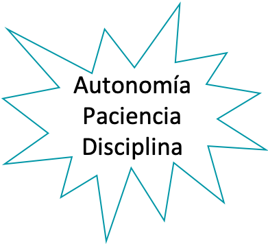

# Producto de Datos

## El equipo!! 🦾🧠

::::{grid}
:gutter: 4

:::{grid-item-card} Sergio A. Holguin
:class-body: text-center
:class-header: bg-light text-center
```{image} _static/images/sergio.JPG
:height: 100
:class: rounded
```
^^^

```{only} html
[](mailto:sergioa.holguin@autonoma.edu.co)
```
:::

::::

::::{grid} 2
:reverse:

:::{grid-item}
:columns: 4
:class: sd-m-auto


:::

:::{grid-item}
:columns: 8
:class: sd-fs-7

Departamento de Informática y Computación · Especialización en Analítica

**Msc. Sergio Alejandro Holguin Garcia**

* Ingeniero Biomédico - Universidad Autónoma de Manizales
* Magíster en Ingeniería - Universidad Autónoma de Manizales
* Candidato a Doctor en Ingeniería - Universidad de Caldas
* Especialista en Deep Learning - DeepLearning.AI

```{only} html
[](https://github.com/BioAITeamLearning)
[](https://scholar.google.com/citations?user=ryk4SsMAAAAJ&hl=es)
```

:::

::::

---

## Objetivos del curso

El objetivo general de esta asignatura es desarrollar competencias en el diseño, implementación y gestión de **productos de datos** — dashboards, informes automatizados y aplicaciones de análisis — que permitan transformar grandes volúmenes de datos en valor tangible para las organizaciones.

De manera específica, buscaremos:

Comprender qué es un producto de datos y las características que lo hacen fiable, reutilizable e interoperable.

Diseñar e implementar soluciones de datos centradas en dominio, aplicando principios de calidad, modularidad y reutilización.

Construir pipelines de datos, dashboards y reportes automatizados utilizando herramientas como Python, R y frameworks web.

Aplicar técnicas avanzadas de contenerización, CI/CD y microservicios para el despliegue de productos de datos en producción.

Diseñar infraestructuras de datos escalables que soporten la estrategia analítica de una organización.

---

## Contenido del curso

::::{grid} 1 1 2 2
:class-container: text-center
:gutter: 3

:::{grid-item-card}
:link: Unidad1
:link-type: doc
:class-header: bg-light

**Unidad 1 🚀**
^^^

**Introducción a Productos de Datos**
Revisión de conceptos de programación (R y/o Python). Desarrollo de reportes automáticos.
:::

:::{grid-item-card}
:link: Unidad2
:link-type: doc
:class-header: bg-light

**Unidad 2 🏗️**
^^^

**Características de Productos de Datos**
Calidad de datos, compartible e interoperable, modular y reutilizable, consumidores y productores de datos.
:::

:::{grid-item-card}
:link: Unidad3
:link-type: doc
:class-header: bg-light

**Unidad 3 📊**
^^^

**Desarrollo de Productos de Datos**
Diseño iterativo, aplicación de ciencia de datos a gestión de productos, dashboards, aplicaciones de datos y proyecto integrador.
:::

:::{grid-item-card}
:link: Unidad4
:link-type: doc
:class-header: bg-light

**Unidad 4 🐳**
^^^

**Técnicas Avanzadas**
Contenerización, integración y despliegue continuo (CI/CD), microservicios.
:::

:::{grid-item-card}
:link: Unidad5
:link-type: doc
:class-header: bg-light

**Unidad 5 ⚙️**
^^^

**Infraestructura de Datos**
Data pipelines, estrategia de datos escalable, centrado en dominio.
:::

::::

---

## Información del curso

- **Programa:** Especialización en Analítica
- **Créditos:** 4
- **Duración:** 16 semanas
- **Horas semanales:** 2 HAP + 9 HAI (11 THS)
- **Asistencia mínima:** 80%

<div style="text-align: center;">
  
</div>

---

## Bibliografía

Estas son algunas de las referencias usadas para este curso.

::::{card-carousel} 2

:::{card}
:margin: 3
:class-body: text-center
:class-header: bg-light text-center
**Product Analytics**
^^^
Joanne Rodrigues — *Product Analytics: Applied Data Science Techniques for Actionable Consumer Insights* — Pearson
:::

:::{card}
:margin: 3
:class-body: text-center
:class-header: bg-light text-center
**Web App Development with R**
^^^
Chris Beeley — *Web Application Development with R using Shiny* — Packt Publishing
:::

:::{card}
:margin: 3
:class-body: text-center
:class-header: bg-light text-center
**Designing Data Products**
^^^
Mario Meir-Huber — *Designing Data Products: The Data Products Series* — Technics Publications
:::

:::{card}
:margin: 3
:class-body: text-center
:class-header: bg-light text-center
**Designing ML Systems**
^^^
Chip Huyen — *Designing Machine Learning Systems* — O'Reilly Media
:::

:::{card}
:margin: 3
:class-body: text-center
:class-header: bg-light text-center
**REST APIs with Django**
^^^
William S. Vincent — *REST APIs with Django: Build powerful web APIs with Python and Django* — Packt Publishing
:::

:::{card}
:margin: 3
:class-body: text-center
:class-header: bg-light text-center
**DevOps Engineering Toolkit**
^^^
Greyson Chesterfield — *DevOps Engineering Toolkit: Terraform, Ansible, Docker and Beyond* — Kindle
:::

::::

---

## Reglas de Juego

* Clases magistrales para conceptualización del tema.
* Quices.
* Trabajo en clase y actividades: Notebooks y repositorios.
* Proyecto Integrador.

### Distribución de Evaluación


:::{card}
:margin: 3
:class-body: text-center
:class-header: bg-light text-center

```{image} _static/images/calificación.png
:height: 300
:::
::::

## ¿Qué vamos a ver durante el curso?

```{tableofcontents}
```